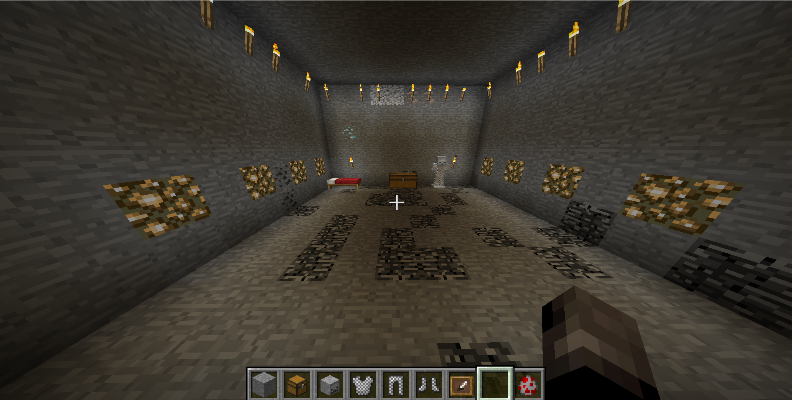

In `2Blue2Hen`, we are given a Minecraft 1.12 screenshot with a visible 10x10 bedrock floor pattern, and we are asked to find the coordinates where the player who took the screenshot is standing.



The fact that the floor is made of bedrock is a crucial hint. Bottom bedrock generation in Minecraft 1.12 is deterministic from chunk coordinates and does not use the world seed, and we know the bounds to search ($[-10,000, 10,000]$ in X and Z). This means we can brute-force search for the location of the visible floor pattern by regenerating the bottom bedrock layers for each possible location and checking whether they match the screenshot.

## Getting the pattern

First we need to get the pattern. For that we can simply check the image, create an imaginary grid, and write it down in a spreadsheet. The final pattern would be like this:


An important and relevant note for the following steps is that there are bedrock blocks in the first layer of the walls, so we know two things from this:

- The probability of a 10x10 bedrock pattern without any bedrock on the highest generated bedrock layer is very low, so we have a signal that we should not only search one Y layer. It is possible (and probable) that the player removed at least one of the bedrock layers to expose this floor pattern, so we should also search on the lower layers ($y=4$ and maybe even $y=3$).

- When performing this kind of attack we usually benefit from knowing the orientation at which the user took the screenshot and its position relative to the chunk bounds. In this case the pattern is only 10x10 and we have no reference for which cardinal direction the player is looking at, so we have to take this into account when performing the exhaustive search.

## Finding the location

Now we need to actually find the location of this pattern. As we said earlier, bottom bedrock generation in Minecraft 1.12 is deterministic from chunk coordinates, so we can simply regenerate the bedrock pattern. Thankfully this is a well known problem and there is a deep understanding of how bedrock is generated in Minecraft, so we can implement the bedrock generator and then brute-force search for the pattern. I used [this gist](https://gist.github.com/LuxXx/32b132a73e4073b9d2fe2544fb09a15d) as a reference and implemented the scanner in C with MPI to split the exhaustive search across multiple processes.

The main point is that we need to rebuild the bottom bedrock layers for each possible block coordinate and check if the pattern matches. We also need to take into account the 8 possible orientations of the pattern (4 rotations and 4 reflections) to make sure we don't miss any possible match. This is not limited to a single chunk: a 10x10 pattern can cross chunk boundaries depending on its starting block.

## Solver logic

The solver is basically a distributed pattern matcher over regenerated bedrock. Instead of loading a Minecraft world, each MPI rank computes the same pseudo-random bedrock decision Minecraft 1.12 makes for each chunk, caches those chunk masks, and then scans a shard of the extracted 10x10 pattern over the search bounds.

We can represent the extracted floor as a binary grid, where `1` means bedrock and `0` means not bedrock:

```c
static int grid[10][10] = {
    {0,0,1,1,0,1,1,1,1,1},
    {0,1,0,0,1,1,0,0,1,0},
    {0,0,0,1,1,1,0,1,0,0},
    {0,0,0,1,1,1,0,1,0,0},
    {1,0,0,0,0,0,1,0,0,0},
    {0,0,1,0,0,1,0,0,0,0},
    {0,0,1,0,1,0,0,1,0,1},
    {0,0,1,0,1,1,0,0,1,0},
    {0,0,0,0,0,0,0,0,0,0},
    {0,0,0,0,0,1,0,0,0,0},
};
```

For each candidate position, the scanner has to try all possible ways the screenshot grid could map onto world coordinates. These are the 4 rotations plus the 4 mirrored versions:

```c
static int transform_point(int t, int x, int z, int *ox, int *oz) {
    switch (t) {
    case 0: *ox = x;         *oz = z;         break; // identity
    case 1: *ox = 9 - z;     *oz = x;         break; // rot90
    case 2: *ox = 9 - x;     *oz = 9 - z;     break; // rot180
    case 3: *ox = z;         *oz = 9 - x;     break; // rot270
    case 4: *ox = 9 - x;     *oz = z;         break; // flip x
    case 5: *ox = x;         *oz = 9 - z;     break; // flip z
    case 6: *ox = z;         *oz = x;         break; // transpose
    case 7: *ox = 9 - z;     *oz = 9 - x;     break; // anti-transpose
    default: return 0;
    }
    return 1;
}
```

The expensive part is bedrock lookup, so the solver first precomputes compact bitmasks for every chunk that could be touched by the search. The generation is driven by Java's 48-bit LCG, seeded only from the chunk coordinates.

One important detail here is that Minecraft uses Java's `Random`, so the exact version of this code has to match Java's `nextInt(5)` behavior. Since 5 is not a power of two, Java uses rejection sampling rather than a plain modulo in the general case. The scanner used a helper equivalent to this:

```c
static int next_int_5(uint64_t *seed) {
    uint32_t bits, val;

    for (;;) {
        *seed = (*seed * 0x5DEECE66DULL + 0xBULL) & ((1ULL << 48) - 1);
        bits = (uint32_t)(*seed >> 17);
        val = bits % 5;

        if ((bits - val + 4) < 0x80000000U) {
            return (int)val;
        }
    }
}
```

Using that same `nextInt(5)` logic, the per-chunk mask generation looks like this:

```c
uint64_t start = java_seed(
    (int64_t)cx * 341873128712LL +
    (int64_t)cz * 132897987541LL
);

for (int lz = 0; lz < 16; lz++) {
    for (int lx = 0; lx < 16; lx++) {
        for (int y = 1; y <= 4; y++) {
            int val = next_int_5_at_offset(col_seed, jump_y[y - 1]);
            if (y <= val) {
                chunks[chunk_index(cx, cz)].row[y - 1][lz] |= (uint16_t)(1U << lx);
            }
        }
        col_seed = apply(jump_col, col_seed);
    }
}
```

After that, checking a candidate is cheap. The MPI part is intentionally simple: rank `r` handles every `size`-th X coordinate, so the ranks do not need to communicate while searching. For this run, the scanner searched `min_x = -10000`, `max_x = 10000`, `min_z = -10000`, `max_z = 10000`, and Y layers `1..4`. For each candidate, the scanner transforms each bedrock cell from the screenshot into world-relative coordinates, looks it up in the precomputed chunk masks, and rejects the candidate as soon as one required bedrock block is missing. Only surviving candidates get a full 100-cell comparison against both bedrock and non-bedrock cells:

```c
for (int x = min_x + rank; x <= max_x; x += size) {
    for (int z = min_z; z <= max_z; z++) {
        for (int y = 1; y <= 4; y++) {
            for (int t = 0; t < 8; t++) {
                int ok = 1;
                for (int i = 0; i < pcount[t]; i++) {
                    Pt p = positives[t][i];
                    if (!is_bedrock_fast(x + p.dx, y, z + p.dz)) {
                        ok = 0;
                        break;
                    }
                }

                if (ok) {
                    int full = 0;
                    for (int gz = 0; gz < 10; gz++) {
                        for (int gx = 0; gx < 10; gx++) {
                            int tx, tz;
                            transform_point(t, gx, gz, &tx, &tz);
                            int have = is_bedrock_fast(x + tx, y, z + tz);
                            if (have == grid[gz][gx]) full++;
                        }
                    }

                    printf("rank=%d positive_match full=%d/100 x=%d y=%d z=%d transform=%s\n",
                           rank, full, x, y, z, tname(t));
                }
            }
        }
    }
}
```

Running it gives us:

```bash
mpicc -O3 -march=native search_bedrock.c -o search_bedrock
mpirun -np 8 ./search_bedrock
```

```log
...
rank=2 positive_match full=100/100 x=1370 y=3 z=490 transform=rot180
```

This means the pattern was found with its matched origin at world/block coordinates `(1370, 3, 490)`, with the screenshot grid rotated 180 degrees before comparing it to the world. In other words, for a screenshot-grid cell `(gx, gz)`, the corresponding world block is:

```text
world_x = 1370 + (9 - gx)
world_y = 3
world_z = 490 + (9 - gz)
```

So the matched 10x10 patch occupies block X `1370..1379`, block Y `3`, and block Z `490..499`. These are block coordinates, not chunk coordinates. The block-coordinate origin `(1370, 490)` is in chunk `(floor(1370 / 16), floor(490 / 16)) = (85, 30)`.

This is the only candidate that matches the pattern, so we can be confident that this is the correct world area.

## Getting the exact coordinates

At this point, we have a single candidate that localized us to a small area of the map, but that is not itself the player's coordinate. It is the origin of the image-derived floor pattern after applying `rot180`.

The matched 10x10 floor patch is at X `1370..1379`, Z `490..499`, and the screenshot-facing direction is back toward that patch from larger Z values. That gives us a much smaller manual search: in Minecraft coordinate terms, the player should be centered near the middle of the patch in X, but standing south of it and looking north toward the bedrock floor and wall. The center of the matched patch is around X `1375`, so I kept X fixed near `1375` and moved along positive Z until the screenshot perspective lined up.

The crosshair is the useful anchor here. In the original screenshot it lands on the same part of the wall/floor geometry as in the recreated view, so matching the crosshair position tells us both the viewing direction and the camera distance from the patch. The matching view placed the player at Z `522`, which is `522 - 499 = 23` blocks south of the far edge of the matched 10x10 floor patch:

```text
matched floor: X 1370..1379, Z 490..499
player:        X 1375,       Z 522
offset:        center X,     +23 blocks from the visible patch
facing:        toward negative Z, back at the matched floor pattern
```

We can also use the crosshair to approximately pinpoint whether the player is standing at the same height relative to the floor by checking for a similar angle and crosshair position on the block being viewed. After matching the recreated view, the player position was:


```text
X: 1375
Y: 5
Z: 522
```

An important Y detail is that F3 shows the player position, not the block coordinate of the block under the player. Since the player is standing on the block below their feet, the target block has Y `5 - 1 = 4`:

```
X: 1375
Y: 4
Z: 522
```

```
UDCTF{1375_4_522}
```

## Greetings

Thanks to the Blue Hens CTF organizers for this amazing challenge and CTF in general, it had a lot of really interesting challenges and I had a lot of fun solving many of the hard-to-solve challenges, it has been a while since I saw a Minecraft challenge that I actually enjoyed solving.
