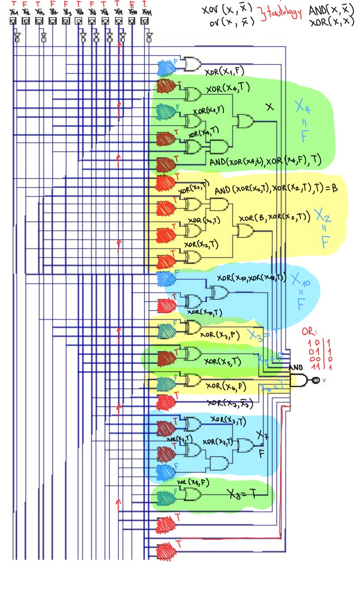

In this Blue Hens CTF 2026 challenge, we are given an image that seems heavily modified/obfuscated for artificial vision. The image contains a propositional logic formula represented as a circuit diagram, and we need to solve it for `TRUE` to recover the values of the 11 input variables in the form `UDCTF{xxxxxxxxxxx}`.

> Circuit diagram of the propositional logic formula given for the challenge.

## Key insight

There are many ways to solve this problem. For example, you could model the whole proposition as a boolean satisfiability problem and use a SAT solver to find the solution; for a circuit of this size, that should not be too hard. However, there is a really "efficient" shortcut we can use here: if you look closely, most of the gates in the circuit are `XOR` and `OR`, and many of them are of the form:

$$ A \oplus \bar{A} = 1 $$

$$ A \lor \bar{A} = 1 $$

$$ A \land \bar{A} = 0 $$

$$ A \oplus A = 0 $$

The key insight is that most of the gates in the circuit end up being a tautology (always true) or a contradiction (always false) regardless of the input value, which makes the circuit much easier to reduce and solve. The second big insight is that all the segments before the final `AND` gate are independent of each other, since each one uses only a single input variable without reusing variables, so we can solve each segment for `TRUE` independently and then combine the results to get the final solution.

## Solving the circuit

At this point, the main task is to determine which segments need to be solved independently. After checking the circuit, the segments are the following:

As we can see, this reduces to solving 12 independent segments, 3 of which are direct inputs to the final `AND` gate. That means we only need to solve the other 9 segments for `TRUE`, since an `AND` gate is `TRUE` only when all of its inputs are `TRUE`.

## Solution
We could get the solution by hand by checking each segment and applying the rules of boolean algebra to reduce it, but that would be very time consuming. So, to understand the process, let's look at a single example: the 5th segment (the first purple one from top to bottom):

Here we have the following circuit:

$$
(X_2 \oplus \bar{X}_2) \oplus [X_{10} \oplus (X_{11} \land \bar{X}_{11})] = 1 \tag{1}
$$

If we decompose we can see that:

$$
X_2 \oplus \bar{X}_2 = 1 \tag{2}
$$

and:

$$
X_{11} \land \bar{X}_{11} = 0 \tag{3}
$$

So if we replace $(3)$ and $(2)$ in $(1)$ we get:
$$
1 \oplus [X_{10} \oplus 0] = 1 \tag{4}
$$

At this point we can use the fact that $A \oplus 1 = \bar{A}$ to get:

$$
\bar{X}_{10} = 1 \tag{5}
$$

And now we use the property that $\bar{A} = 1$ is equivalent to $A = 0$ to get:
$$
X_{10} = 0 \tag{6}
$$

We can simply repeat this process for all the segments to get the following solution:

| Variable | Value |
| --- | --- |
| $X_1$ | 1 |
| $X_2$ | 0 |
| $X_3$ | 1 |
| $X_4$ | 0 |
| $X_5$ | 0 |
| $X_6$ | 1 |
| $X_7$ | 0 |
| $X_8$ | 1 |
| $X_9$ | 1 |
| $X_{10}$ | 0 |
| $X_{11}$ | 1 |

 

So the flag is `UDCTF{10100101101}`.

## Conclusion

This challenge shows that not every reverse engineering problem consists of taking a binary and trying to reverse it. The field of reverse engineering is much broader and can include almost any kind of problem. In this case, we had to reverse engineer a propositional logic formula, or more precisely, a logic `circuit`. Just as with binary reverse engineering, the same kind of reasoning applies here: reverse engineering a logic circuit or boolean formula can reveal how to bypass it, which in a real-world scenario could allow a malicious user to circumvent security measures, or in the case of CTFs, solve the challenge and get the flag. This is a great example of how reverse engineering can be applied across different fields and used to solve problems that at first glance may seem unrelated to reverse engineering.

## Extra: My full solve by hand (do not take it as fully correct, especially the formulas)

## Greetings

Thanks to the Blue Hens CTF organizers for this amazing challenge and CTF in general, it had a lot of really interesting challenges and I had a lot of fun solving many of the hard-to-solve challenges, also the decision of making the image hard to read for AI was really interesting, as it really made the challenge harder for an LLM without making it impossible or a hassle for a human, I really liked that decision and I hope to see more challenges like this in the future.
