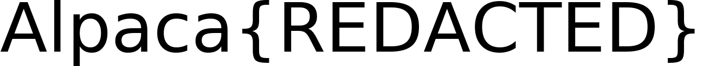
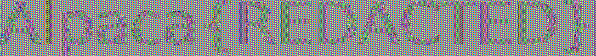
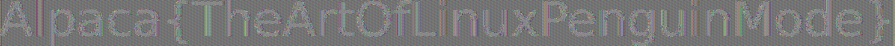

This challenge presents us with quite a different scenario than most cryptography challenges. We are given a Python script that encrypts data using the Python `Crypto` library's AES implementation. It generates a random key using `os.urandom` and encrypts a BMP file containing a rendered image of the flag. The vulnerability lies in the choice of the ECB cipher mode. Because ECB provides no diffusion across blocks, we can still observe meaningful structural patterns in the resulting ciphertext, even though the data itself is encrypted.

# Why ECB+BMP Completely Breaks the Cipher

To understand why this works, we need to review both how ECB mode works and how a BMP file is structured.

## BMP format
A BMP file is a bitmap (raster graphics) file format that stores image data in the following way:


As we can see in the diagram, the first 14 bytes are the file header, which contains metadata about the file, such as the file size and the offset where the pixel data starts. The next 40 bytes are the DIB header, which contains more detailed information about the image, such as its width, height, color depth, and compression method. After that we have an optional color table (used for indexed-color images) or bit masks (used for certain types of images), and finally we have the pixel array, which contains the actual image data.

```python
# Generate image
font = ImageFont.truetype("DejaVuSans.ttf", 128)
draw = ImageDraw.Draw(Image.new("RGB", (1, 1), "white"))
left, top, right, bottom = draw.textbbox((0, 0), flag, font=font)

img = Image.new("RGB", (right - left, bottom - top), "white")
draw = ImageDraw.Draw(img)
draw.text((-left, -top), flag, fill="black", font=font)

img.save("flag.bmp")
```

Now we need to check the implementation of `PIL` a bit to see how it saves the image. As shown in the [Pillow source code](https://github.com/python-pillow/Pillow/blob/main/src/PIL/BmpImagePlugin.py), when saving an RGB image into the `BMP` format, it writes a 14-byte File Header (containing the magic number and file size) followed immediately by a 40-byte DIB Header (specifically a `BITMAPINFOHEADER`, which holds the width, height, color depth, and compression method). After this, the pixel data is written in 24-bit Windows BMP format.

## ECB Cipher Mode and Why It Fails

Now let's focus on the cipher mode. ECB (Electronic Codebook) is a mode of operation for block ciphers. It is the most basic and inherently insecure mode of operation, where each block of plaintext is encrypted independently using the same key. As a result, identical plaintext blocks always produce identical ciphertext blocks. This opens the door to vulnerabilities like block replay attacks. More importantly for this challenge, it preserves structural patterns from the original plaintext within the ciphertext.

Let's see it with an example. Here the same plaintext block appears twice: in ECB it encrypts to the same ciphertext block both times, while in CBC the IV and chaining make the outputs different.


In the following image we can see an example of how the same image looks when encrypted with ECB and CBC. In the ECB version we can faintly see the structure (mostly because it is a highly entropic image, but still), while in the CBC version it looks like pure noise. In a much simpler image, like the text image we have in this challenge, the structure would be much more evident, allowing us to easily read the flag even without decrypting it.


# Recovery

At this point we know the attack vector; now we just need to apply it and recover the flag. First we need to get an example flag to understand the header and write a solver to reconstruct the header, allowing image viewers to parse the encrypted output as a valid BMP. If we comment out the last line of `chall.py`:

```python
...
data = pad(open("flag.bmp", "rb").read(), 16)
open("flag.enc", "wb").write(aes.encrypt(data))

#os.unlink("flag.bmp")
```

This way, the `flag.bmp` file will be left in the filesystem, and we can inspect how the header looks.

```log
00000000: 42 4d 66 5d 07 00 00 00 00 00 36 00 00 00 28 00  BMf]......6...(.
00000010: 00 00 11 05 00 00 7c 00 00 00 01 00 18 00 00 00  ......|.........
00000020: 00 00 30 5d 07 00 c4 0e 00 00 c4 0e 00 00 00 00  ..0]............
00000030: 00 00 00 00 00 00                                ......
```

To rebuild the BMP header, we need three things: the `width`, the `height`, and the amount of PKCS#7 `padding` that was added before encryption. Once we know those values, we can recreate the standard `54`-byte `24-bit` BMP header, copy the encrypted bytes after that header, and trim the final padding bytes so image viewers accept the file and render the ECB block structure.

We can recover the exact height from the sample image because the challenge uses the same font and rendering code for both the sample and the real flag. The text content changes the width, but the vertical bounding box stays the same. From the sample BMP we get:





```log
00000010: 00 00 11 05 00 00 7c 00 00 00 01 00 18 00 00 00
```

In that line, the width is `0x00000511 = 1297` and the height is `0x0000007c = 124`, so we can reuse `height = 124` for the real file as well.

Then we infer the width of an arbitrary flag image from the encrypted file size. Since the challenge encrypts the whole BMP, the ciphertext length is the padded BMP length, so for some padding value $p \in \{1, \dots, 16\}$:

$$
\operatorname{bmp\_size} = |\texttt{flag.enc}| - p
$$

For these Pillow-generated BMPs, the file size also satisfies:

$$
\operatorname{bmp\_size} = 54 + h \cdot \operatorname{row\_stride}
$$

with

$$
\operatorname{row\_stride} = 4 \left\lceil \frac{3w}{4} \right\rceil
$$

So, using the known sample height $h = 124$, we obtain:

$$
\operatorname{row\_stride} = \frac{|\texttt{flag.enc}| - p - 54}{124}
$$

and therefore:

$$
4 \left\lceil \frac{3w}{4} \right\rceil = \frac{|\texttt{flag.enc}| - p - 54}{124}
$$

This gives the width bounds used by the solver:

$$
\operatorname{row\_stride} - 3 \le 3w \le \operatorname{row\_stride}
$$

$$
\left\lceil \frac{\operatorname{row\_stride} - 3}{3} \right\rceil \le w \le \left\lfloor \frac{\operatorname{row\_stride}}{3} \right\rfloor
$$

Substituting the stride expression:

$$
\left\lceil \frac{\frac{|\texttt{flag.enc}| - p - 54}{124} - 3}{3} \right\rceil
\le w \le
\left\lfloor \frac{|\texttt{flag.enc}| - p - 54}{372} \right\rfloor
$$

Trying $p \in \{1, \dots, 16\}$ leaves a single valid width for the real file, which is enough to rebuild the BMP header and make the encrypted image viewable. The last missing value is the PKCS#7 padding itself, but that is already included in the same search: we simply test all padding lengths from `1` to `16` and keep the candidate that produces valid BMP dimensions.

# Solver

Our solver doesn't need to be a generic utility. Since we already know the BMP format, have a fixed height of `124` pixels, and only possess the encrypted `.enc` file, a target-specific script is sufficient. This script simply infers the width and padding directly from the ciphertext length and reconstructs a valid BMP header.

First, we only load the encrypted file and set the variables we need:

```python
import struct
import sys
from pathlib import Path


BMP_HEADER_SIZE = 54
HEIGHT = 124

enc_path = Path(sys.argv[1]) if len(sys.argv) > 1 else Path("flag.enc")
out_path = Path(sys.argv[2]) if len(sys.argv) > 2 else Path("flag_rebuilt.bmp")

encrypted = enc_path.read_bytes()
file_size = None
padding_len = None
width = None
row_stride = None
```

Now we need to infer the width and padding length from the encrypted file size. For padding we can simply try all values from `1` to `16`, and for each of those we can compute the candidate BMP size, derive the row stride from the fixed height, and check if it matches the `24-bit` BMP row-padding rule:

```python
for p in range(1, 17):
    candidate_file_size = len(encrypted) - p
    image_size = candidate_file_size - BMP_HEADER_SIZE

    if image_size <= 0 or image_size % HEIGHT != 0:
        continue

    candidate_row_stride = image_size // HEIGHT
    if candidate_row_stride % 4 != 0:
        continue

    min_width = max(1, (candidate_row_stride - 3 + 2) // 3)
    max_width = candidate_row_stride // 3

    for w in range(min_width, max_width + 1):
        if ((w * 3 + 3) // 4) * 4 == candidate_row_stride:
            width = w
            file_size = candidate_file_size
            padding_len = p
            row_stride = candidate_row_stride
            break

    if width is not None:
        break

if width is None:
    raise SystemExit("Could not infer BMP dimensions from the encrypted file")
```

Once those values are known, we can rebuild the BMP header like this:

```python
header = bytearray(
    struct.pack(
        "<2sIHHI"
        "IiiHHIIiiII",
        b"BM",
        BMP_HEADER_SIZE + row_stride * HEIGHT,
        0,
        0,
        BMP_HEADER_SIZE,
        40,
        width,
        HEIGHT,
        1,
        24,
        0,
        row_stride * HEIGHT,
        3780,
        3780,
        0,
        0,
    )
)

print(
    f"Inferred width={width}, height={HEIGHT}, "
    f"file_size={file_size}, PKCS#7_padding={padding_len}, row_stride={row_stride}"
)
```

Finally, we can write the rebuilt file by taking the new header and appending the encrypted bytes up to the inferred BMP size:

```python
rebuilt = bytes(header) + encrypted[BMP_HEADER_SIZE:file_size]
out_path.write_bytes(rebuilt)

print(f"Wrote {out_path} ({width}x{HEIGHT}, {len(rebuilt)} bytes)")
```

The only important part here is the slice `encrypted[BMP_HEADER_SIZE:file_size]`. With this, we are skipping the first `54` bytes of the encrypted file, which correspond to the original BMP header, and we are also trimming the trailing PKCS#7 padding bytes, so the resulting file is a valid BMP that can be opened by image viewers.

# Results

When we run the solver on the real encrypted file, we get the following output:

```log
$ python solver.py real/flag.enc real/flag_rebuilt.bmp
Inferred width=2374, height=124, file_size=883430, PKCS#7_padding=10, row_stride=7124
Wrote real/flag_rebuilt.bmp (2374x124, 883430 bytes)
```

The resulting `flag_rebuilt.bmp` looks like this:



As we can see once again, even if the content of the independent blocks is clearly encrypted, because there is no diffusion between blocks, we can still see the structure of the flag, which is enough to read it without even decrypting it. The flag is `Alpaca{TheArtOfLinuxPenguinMode}`.

# Conclusion

This challenge is a clear and almost textbook example of why cipher modes are important for block ciphers, and how using a weak mode like ECB can lead to a theoretical "good" ciphertext that is actually completely broken in practice. While individual blocks maintain secure properties, the lack of diffusion, due to the absence of chaining or other mechanisms to mix the output of one block into the input of the next, makes the cipher susceptible to block-level attacks. In this case, this flaw is enough to leak the structure of the plaintext and reveal the flag without even decrypting it.

# References

- Pillow source code (BmpImagePlugin): https://github.com/python-pillow/Pillow/blob/main/src/PIL/BmpImagePlugin.py
- Microsoft BITMAPINFOHEADER documentation: https://learn.microsoft.com/en-us/windows/win32/api/wingdi/ns-wingdi-bitmapinfoheader
