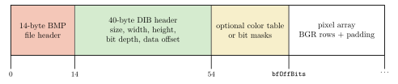
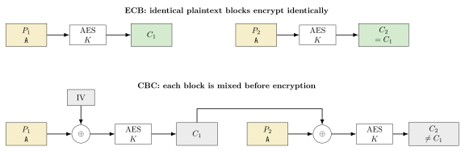
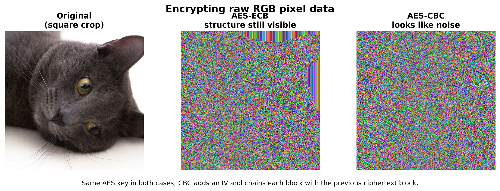

This challenge present us with quite a different scenario than most cryptography challenges. We are given a python code that ciphers with the python `Crypto` implementation of AES, using `os.urandom` to generate the key, and use to cipher a bmp file with a render of the flag. The weak point comes from the fact that the cipher mode is ECB, which gives no diffusion between blocks, so even if the data is technically encrypted, we can still "see" meaningful structure from the relation between blocks.

# Why ECB+BMP completly breaks the cipher

To understand why this works, we need to review both how does ECB mode works and how does a BMP file is structured.

## BMP format
A BMP file is a bitmap (raster graphics) file format that stores image data in the following way: 

## ECB cipher mode

Now let's see the other part, ECB (Electronic Codebook) is a mode of operation for block ciphers. ECB is the simplest and "less effective" mode of operation, where each block of plaintext is encrypted independently using the same key. This means that identical plaintext blocks will produce identical ciphertext blocks, which allows some attack vectors, block replay attacks (Checking if a block is the same as another one) and also (and important for us this time) it allows to see patterns from the relation between blocks that were present in the plaintext.

Let's see it with an example. Here the same plaintext block appears twice: in ECB it encrypts to the same ciphertext block both times, while in CBC the IV and chaining make the outputs different.

The classic visual demo makes the same point even more clearly. If we take the raw RGB bytes of an image and encrypt them block-by-block, ECB still leaks the large-scale structure of the cat, while CBC destroys that pattern and turns the result into noise.

