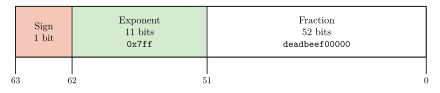
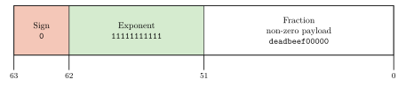

The challenge presents us with some files, the most important of which is `chal.c`. It mostly performs basic rule validation and parsing, and if the checks are successful, it prints the flag.

We are asked for a 16-digit hexadecimal string. The program validates both the length and the characters, checks if the hex string contains the substring `deadbeef`, parses the string as a 64-bit unsigned integer, copies the raw bytes of that integer into a `double` (floating-point value), and checks if it is a NaN (Not a Number). If all the checks pass, we get the flag.

To get the flag, we must create an input that satisfies all the checks, which means we need to create a NaN that contains the substring `deadbeef` in its hexadecimal representation. To do so, we first need to understand how NaN values and floating-point numbers in general are represented in memory.

This trick relies on the target environment using IEEE 754 binary64 for `double` and on the program interpreting the parsed integer's bit pattern as that `double` representation. In practice, that is exactly what the challenge environment does.

# How IEEE 754 doubles work

To solve the challenge, we need to look at how double-precision floating-point numbers are represented. The common representation for floating-point numbers is IEEE 754 binary64, usually called a `double` in C. It uses `64` bits split into three fields:

- `1` sign bit
- `11` exponent bits
- `52` fraction bits, which are used to form the significand



For normal finite values, the exponent field and fraction field work together to represent a real number. But there are also special cases that the standard defines. The important rules are:

- if the exponent is all `1`s and the fraction field is all `0`s, the value is infinity
- if the exponent is all `1`s and the fraction field is not all `0`s, the value is NaN
- if the exponent is all `0`s and the fraction field is not all `0`s, the value is subnormal
- if the exponent is all `0`s and the fraction field is all `0`s, the value is zero

So the important insight is that there is not just a single NaN value. There are many different bit patterns that represent NaN, as long as the exponent is all `1`s and the fraction field is not all `0`s. This means we can use the fraction field to store 52-bit data, including the substring `deadbeef` that the challenge requires.

There is one more small detail: NaNs can be quiet NaNs or signaling NaNs. In binary64, the most significant bit of the fraction field is commonly used to distinguish them; when that bit is set, the value is a quiet NaN. Our value starts the fraction field with `d` (`1101` in binary), so that bit is set, making the chosen value `7ffdeadbeef00000` a quiet NaN.

# Crafting the NaN

Now we just need to build a `64`-bit value that satisfies what we just said. To make it easier, we can simply encode `0xdeadbeef` and pad it with `0`s to fill the `52`-bit fraction field. Any other non-zero value would work as well, as long as it contains the required substring.



The sign bit does not matter for NaN, so we can set it to `0`. If we wanted a negative NaN, the sign bit could be `1` instead.

# Solution

Now, with the number ready, we can execute the local and remote binaries to get the flag. The input we need to provide is the hexadecimal representation of the NaN we just crafted, which is `7ffdeadbeef00000`.

Locally, we can confirm that this satisfies the challenge binary:

```log
$ ./chal
Send 16 hex digits.
> 0x7ffdeadbeef00000
Alpaca{REDACTED}
```

> The `0x` prefix is already printed to stdout by the binary, so we just need to input the hex digits after it.

The same input works against the remote service:

```log
$ nc 34.170.146.252 60060
Send 16 hex digits.
> 0x7ffdeadbeef00000
Alpaca{IEEE 754 is the standard for floating-point arithmetic}
```

# Conclusion

This was a fun little challenge. More than a "cybersecurity" challenge, it was a "computer science" challenge, which is something I enjoy too. Even so, there could be some security implications to this kind of thing. Maybe not exactly this case of checking a NaN, but the general idea of creating "valid" data in a way that hides information or a payload in its binary representation could be used in some kind of obfuscation or evasion technique. There are also some specific security implications of NaNs, such as the NaN-boxing technique used in some JavaScript (like V8) engines to represent different types of values in a single 64-bit word, which relies on the fact that there are many different NaN bit patterns available.

# Greetings

As always, thanks to the AlpacaHack team for hosting these daily challenges, and thanks to pppp4649 for creating this one. It is a clean little floating-point exercise, and I always enjoy challenges where the entire solve depends on reading a binary layout carefully.

# References

1. The IEEE 754 Format: https://mathcenter.oxford.emory.edu/site/cs170/ieee754/
