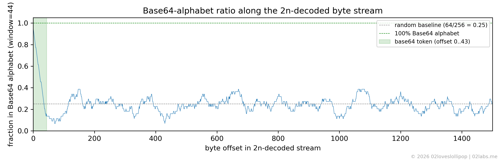
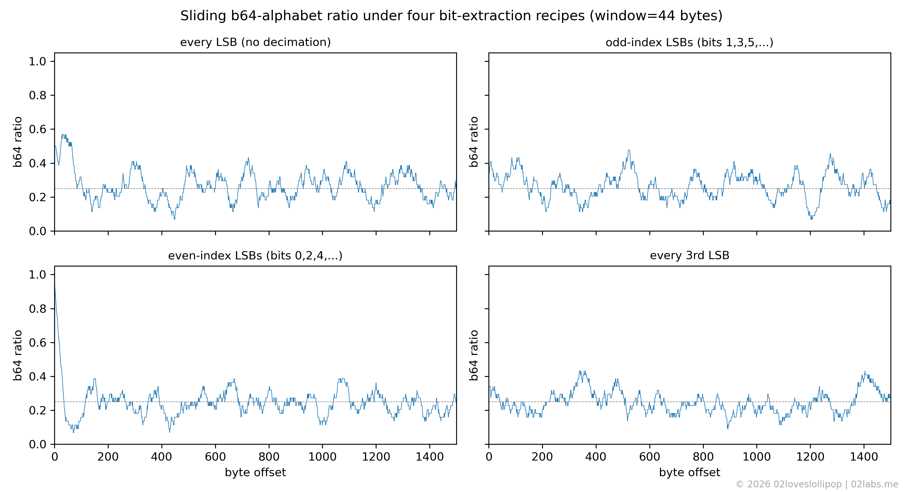

We are given an image `monke_thinkin.png`, which contains the famous [Thinking Monkey](https://knowyourmeme.com/memes/thinking-monkey) meme.

# 1. Initial Analysis

On challenges like this, where all you are given is an image, there are usually two paths: either the image contains hidden data (steganography) or it is a hint that points somewhere else, often OSINT.

Running `binwalk monke_thinkin.png` revealed a ZIP archive embedded in the image at offset $0x84FFA$.

The `binwalk` output looks like this:

```bash
$ binwalk monke_thinkin.png
DECIMAL       HEXADECIMAL     DESCRIPTION
--------------------------------------------------------------------------------
0             0x0             PNG image, 676 x 676, 8-bit/color RGB, non-interlaced
137           0x89            Zlib compressed data, best compression
544570        0x84F3A         TIFF image data, big-endian, offset of first image directory: 8
544762        0x84FFA         Zip archive data, encrypted at least v2.0 to extract, compressed size: 731593, uncompressed size: 731466, name: monke2n.png
1276521       0x137A69        End of Zip archive, footer length: 22
```

The ZIP is password-protected, but we can crack it with `zip2john` and `john` using a wordlist (`rockyou.txt` in this case). The workflow looks like this:

```bash
$ zip2john hidden.zip > hidden.hash
$ john --wordlist=rockyou.txt hidden.hash
monkeybusiness    (hidden.zip/monke2n.png)
```

After extracting the ZIP file using the password, we find another image, `monke2n.png`. At this point we could try both OSINT and steganography on the new image. Initial steganography attempts showed no promising results, so we went back to OSINT and found the source of the image in a DeviantArt post, but this branch also led to a dead end.

# 2. The insight: Why is the file named `monke2n.png`?

Something that could be obvious but is easy to overlook is the name of the file. The extracted image is named `monke2n.png`, which suggests that this step might involve $2n$, meaning even indices. After trying this hint in several places (keeping or discarding even/odd indexed bits in the raw pixel bytes, image rows/columns, and LSB planes), the biggest breakthrough came from applying the $2n$ hint to the LSB plane. That revealed a Base64 string that decoded to the flag.

# 3. Why this specific pipeline?

Showing that *something* is hidden in the LSB plane is easy; showing that "flatten the image as $H \cdot W \cdot C$ row-major bytes, take their LSBs, keep every $2n$-th bit, and pack MSB-first" is the *one* pipeline that produces a meaningful payload is harder. The point we want to make is that small perturbations to any step in this pipeline do not yield results that look "almost right" - they yield results that look completely random.

To check this we need a metric that tells useful bytes apart from random ones. The payload turns out to be a Base64 string, and the Base64 alphabet (`A-Za-z0-9+/`) covers only $64$ out of $256$ possible byte values. So a window of random bytes lands inside that alphabet with probability $\tfrac{64}{256} = 0.25$, while a window of real Base64 lands there with probability close to $1.0$ (apart from padding). Sliding a 44-byte window (the length of the token) across the decoded stream and plotting that fraction at every offset gives us a diagnostic that makes the right pipeline jump out.



Running the same metric under four plausible bit-extraction pipelines makes the contrast unambiguous:



The incorrect pipelines sit at $\sim 0.25$, especially after the 44-byte offset. The only one that spikes to $r \approx 1.0$ is the `even-index LSBs, MSB-first` pipeline, which is the correct one. To make this completely airtight, here are the first 44 raw bytes that come out of each pipeline (non-printable bytes shown as `·`):

| pipeline                                     | first 44 bytes                                  |
|----------------------------------------------|-------------------------------------------------|
| every LSB, MSB-first                         | `` v·)·gXbdvS_Rw]dj,'····.+)·i·j·/·=7b8··i·q··K`` |
| odd-index LSBs, MSB-first                    | `` ········#P6!···9w·4··Io·U····>_*XA··kJ···]FV `` |
| every 3rd LSB, MSB-first                     | `` b·3|·+iJ··?r"···O·····N=^·tD·k·)·$··J9··U··O `` |
| even-index LSBs, LSB-first                   | `` ·vJ*··J··L··F··^·j·······^r··^Jf····Fv···J3· `` |
| **even-index LSBs, MSB-first (ours)**        | `` QnRTQ1RGe20wbmszeV9kM3YxczNkXzRfcGw0bn0=·R·Q `` |

Four of the five pipelines are essentially random noise; the printable characters they do produce are scattered uniformly, exactly as expected for random bytes. Only the even-index, MSB-first recipe gives us a contiguous, $44$-byte run of clean Base64 characters terminated by the `=` padding, which is especially telling. Then we can simply decode the Base64 to get the flag.

# 4. Solution

The solver was implemented in Python using the Einops library for the tensor rearrangements.

First we import the required modules:

```python
from PIL import Image
import numpy as np
import base64
import re
from einops import rearrange
```

At this point we need to load the image and convert it to RGB format, which ensures the array has exactly three channels. The result is a 3D array of shape (H=676, W=676, C=3):

```python
a = np.array(Image.open("monke2n.png").convert("RGB"))
```

Now we flatten the image into a 1D array by applying the following transformation: `h w c -> (h w c)`, which means that we are going to flatten the image into a stream where the first 3 bytes correspond to the R, G, B values of the first pixel, the next 3 bytes correspond to the R, G, B values of the second pixel (from left to right, top to bottom), and so on. Then we extract the least significant bit of each byte by applying a bitwise AND with `0b1`:


```python
flat = rearrange(a, "h w c -> (h w c)") 
bits = flat & 0b1
```

Next, we apply the $2n$ decimation by pairing up the bits and keeping the even-indexed bit from each pair. First we ensure the number of bits is even: we calculate the number of complete pairs, trim the bit array to that length, rearrange the bits into pairs, and keep the first bit of each pair:

```python
n_pairs = bits.size // 2
bits = bits[: n_pairs * 2]
pairs = rearrange(bits, "(n two) -> n two", two=2)
even_bits = pairs[:, 0]
```

At this point we need to rebuild a bytestring from these bits. As section 3 showed, the correct packing direction is MSB-first (big-endian): the first bit of each 8-bit group becomes the most significant bit of the resulting byte. Like the previous step, we first ensure the number of bits is a multiple of 8, calculate the number of complete bytes, and trim the bit array to that length. Then we rearrange the bits into groups of 8 and rebuild the bytes using the mapping $\mathbb{F}_2^{\lfloor\frac{N}{8}\rfloor \times 8} \to \mathbb{F}_{2^8}^{\lfloor\frac{N}{8}\rfloor}$ (in normal terms: every row of 8 bits becomes one byte) by taking the dot product with the powers-of-two weight vector $[2^7, 2^6, \dots, 2^0]$.

```python
n_bytes = even_bits.size // 8
even_bits = even_bits[: n_bytes * 8]
groups = rearrange(even_bits, "(b eight) -> b eight", eight=8)
weights = 1 << np.arange(7, -1, -1) # [128, 64, 32, ..., 1]
blob = (groups * weights).sum(axis=1).astype(np.uint8).tobytes()
```

Finally, we can interpret the resulting bytestring as ASCII and extract the Base64 token using a regex that searches for a substring of at least 30 Base64 characters followed by 0, 1, or 2 `=` padding characters. Then we decode the Base64 to get the flag:

```python
token = re.search(rb"[A-Za-z0-9+/]{30,}={0,2}", blob).group()
print("base64 token:", token.decode())
print("FLAG:        ", base64.b64decode(token).decode())
```

Running it:

```bash
$ python3 solve.py
base64 token: QnRTQ1RGe20wbmszeV9kM3YxczNkXzRfcGw0bn0=
FLAG:         BtSCTF{m0nk3y_d3v1s3d_4_pl4n}
```


# 5. Flag

```text
BtSCTF{m0nk3y_d3v1s3d_4_pl4n}
```
