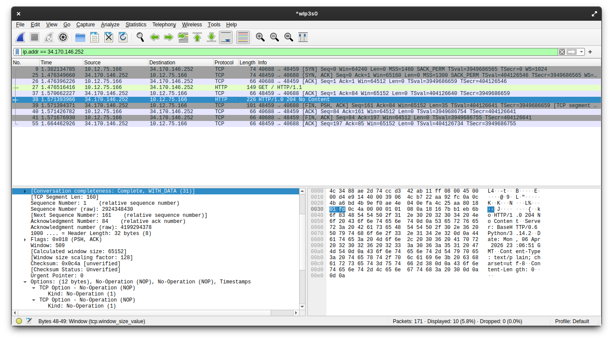
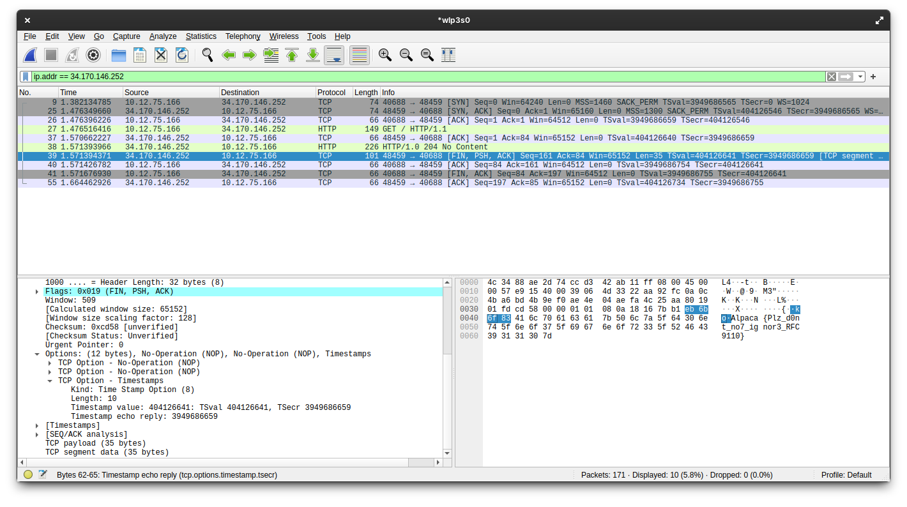

I almost never write web writeups, mostly because I do not really enjoy web challenges. Still, this one was simple and funny enough that I thought it would be a good excuse to write a bit about how HTTP works for a challenge so simple that I did not even have to open VS Code.

The challenge was simple: we are given a URL, and when we try to open it in a browser, literally nothing happens. Why? Because all there is is an HTTP `204 No Content` response with `Content-Length: 0`, so there is no content to render and the browser just ignores it.

We get a similar result when we try to fetch the URL with `curl`, even if we add the `--raw` and `-iv` flags to inspect the raw response and the headers:

```bash
$ curl -iv --raw http://34.170.146.252:28474/
*   Trying 34.170.146.252:28474...
* Established connection to 34.170.146.252 (34.170.146.252 port 28474) from 192.168.1.3 port 38954 
* using HTTP/1.x
> GET / HTTP/1.1
> Host: 34.170.146.252:28474
> User-Agent: curl/8.16.0
> Accept: */*
> 
* Request completely sent off
* HTTP 1.0, assume close after body
< HTTP/1.0 204 No Content
HTTP/1.0 204 No Content
< Server: BaseHTTP/0.6 Python/3.14.2
Server: BaseHTTP/0.6 Python/3.14.2
< Date: Tue, 07 Apr 2026 07:50:44 GMT
Date: Tue, 07 Apr 2026 07:50:44 GMT
< Content-Type: text/plain; charset=utf-8
Content-Type: text/plain; charset=utf-8
< Content-Length: 0
Content-Length: 0
< 

* shutting down connection #0
```

At first glance, the response looks empty, but if we take a look at the source code:

```python
def do_GET(self):
        if self.path == "/":
            body = FLAG.encode("utf-8")

            self.send_response(204) # No Content
            self.send_header("Content-Type", "text/plain; charset=utf-8")
            self.send_header("Content-Length", "0") # Make sure there's no content
            self.end_headers()
            self.wfile.write(body) # Oops!
        else:
            self.send_error(404, "Not Found")
```

We immediately notice something important: the server is actually sending something else. It calls `self.wfile.write(body)` with the flag, so the challenge becomes interesting right away. The next logical step is to understand why we cannot see the flag even though it is being sent in the response body. The flag itself gives us a hint, which we will discuss later, but first let us look at the laziest possible way to solve the challenge. If we know the bytes are being sent, we can just sniff the traffic with Wireshark and inspect the raw TCP stream, since the service is being served over plain HTTP.

## The lazy solution: Sniffing the traffic

All we need to do is start a capture on the network interface we are currently using, and then make an HTTP GET request to the URL.

We can simply execute the same `curl` command again and stop the capture once it finishes.

So once again:

```bash
$ curl -iv --raw http://34.170.146.252:28474/
*   Trying 34.170.146.252:28474...
* Established connection to 34.170.146.
...
* shutting down connection #0
```

Then we need to filter the capture, because unless we are in a perfectly isolated environment, we will probably have a lot of unrelated traffic that only adds noise. The easiest and most effective filter here is `ip.addr == 34.170.146.252`:



As we can see in the image, this filter leaves us with 10 packets. Let us look at what they are.

The first 3 packets are the TCP handshake: `SYN`, `SYN-ACK`, and `ACK`. This is standard for any TCP connection, so it is not particularly interesting here.

The 4th packet is the HTTP GET request. This is just the packet we sent when executing the `curl` command, so it is also not especially interesting.

The 5th packet is the TCP `ACK` for the HTTP GET request. Again, nothing special.

Now we get to the interesting part. If we inspect the 6th packet, we can see the HTTP response with the `204 No Content` status code and the headers. As expected, there is no visible body there, just like in `curl`. But then we get to the 7th packet:



This packet is the `[FIN, PSH, ACK]` packet. It carries the raw TCP payload containing the response body, and if we inspect that payload, we can clearly see the flag: `Alpaca{Plz_d0nt_no7_ignor3_RFC9110}`.

The last 3 packets are the TCP connection teardown, following the standard `ACK -> [FIN, ACK] -> ACK` sequence. These are also routine and not especially relevant.

## Why can't we see the flag in the response?

This is where the flag gives us a hint and explains why `curl` did not show the response body.

RFC 9110 is the latest Request for Comments document that defines modern HTTP semantics. It was published in June 2022, and it explains very clearly why we cannot see the flag in the response.

There are two parts of the current HTTP semantics being violated by the server code, and together they explain why the body is ignored.

The first is that section `8.6 Content-Length` states:

> A server MUST NOT send a Content-Length header field in any response with a status code of 1xx (Informational) or 204 (No Content). A server MUST NOT send a Content-Length header field in any 2xx (Successful) response to a CONNECT request (Section 9.3.6).

This is already a clear violation of HTTP semantics, because the server is sending both a `204` response and a `Content-Length` header. However, this is probably not the main reason we do not see the flag. The more important point is in `15.3.5 204 No Content`, where the RFC says:

> A 204 response is terminated by the end of the header section; it cannot contain content or trailers

This is the real reason we cannot see the flag in the response. By sending `204 No Content`, the server is explicitly signaling that there is no content after the headers. As a result, most HTTP implementations will stop parsing the response once the headers end and ignore anything that comes after. This also suggests another solution path: instead of sniffing the traffic, we could write a minimal custom client that ignores the semantic meaning of `204` and just reads raw bytes from the TCP connection. For example:

```python
import socket

host = "34.170.146.252"
port = 28474

req = (
    "GET / HTTP/1.1\r\n"
    f"Host: {host}:{port}\r\n"
    "Connection: close\r\n"
    "\r\n"
).encode()

with socket.create_connection((host, port)) as s:
    s.sendall(req)
    data = b""
    while True:
        chunk = s.recv(4096)
        if not chunk:
            break
        data += chunk

print(data.decode("utf-8", errors="replace"))
```

And this is the output we would get:

```log
HTTP/1.0 204 No Content
Server: BaseHTTP/0.6 Python/3.14.2
Date: Tue, 07 Apr 2026 08:37:30 GMT
Content-Type: text/plain; charset=utf-8
Content-Length: 0

Alpaca{Plz_d0nt_no7_ignor3_RFC9110}
```

This code sends an HTTP GET request to the server and then reads the raw response without trying to interpret it as a valid HTTP response. That way we can see the flag without any problem. That is why I said that HTTP is just a social construct: if we choose not to follow the protocol rules, we can still get the result we want, because in the end HTTP is just a set of conventions we have agreed to use when communicating.

## Conclusion

Maybe this is a bit of a stretch, but what I liked most about this challenge is that it highlights what protocols really are: nothing more than rules. They are rules we can sometimes bend and still get things to work. Of course, protocols exist for a reason, because letting everyone interpret HTTP responses however they want would obviously not end well.

## Greetings

As always with these AlpacaHack Daily challenges, I want to thank the AlpacaHack team for hosting them. They really are a fresh and less competitive alternative to the usual CTF format. Also, thanks to tchen for creating this interesting challenge.

## References

1. RFC 9110: https://www.rfc-editor.org/rfc/rfc9110.html
