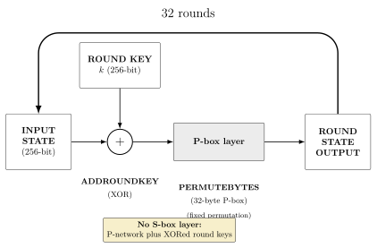

This time we are presented with a "familiar" setting, just as in [Carry the Flame](https://blog.02labs.me/posts/carry-the-flame/) we are given an "SPN"-style block cipher, but this time with some twists. First of all we are working with a 256-bit block/key size instead of the 40-bit block/key size of Carry the Flame. The second twist is the number of rounds, which is 32 instead of the "insane" 1024 rounds of Carry the Flame, which makes the cipher much more manageable. The third twist is that we are limited in the number of oracle/guess queries we can make (210 at most), and the last and most important twist is that the cipher is not actually an SPN, because the S-box went missing. As such, a major weakness appears: since the S-box is the only non-linear element of an SPN, all of these rounds, XORs, and permutations collapse into a simple linear problem. So we can recover the key by solving a linear system over $GF(2$) for the key by taking a plain/cipher pair and solving for the key with something like Gaussian elimination.



## Modeling the cipher as a linear system

In this challenge we have a 32-byte (256-bit) bytewise permutation, so we need to convert that into a bit-equivalent matrix in $GF(2)^{256\times 256}$ that maps each input bit position to its corresponding output bit position.

We'll define that matrix as $P$. Then let:

* $C_n$: Cipher after $n$ rounds

* $k$: Key

* $p_t$: Plaintext

Then we can define the first cipher round as:

$$
C_1 = P(k \oplus p_t)
$$

And the next rounds as:

$$
C_2 = P(k \oplus C_1) = P(k \oplus P(k \oplus p_t)) = P^2 k \oplus P^2 p_t \oplus P k
$$

$$
C_3 = P(k \oplus C_2) = P(k \oplus P^2 k \oplus P^2 p_t \oplus P k) = P^3 k \oplus P^3 p_t \oplus P^2 k \oplus P k
$$

We end up with the following general form:

$$
C_n = \left(\sum_{i=1}^n P^i\right) k \oplus P^n p_t
$$

And for the full 32 rounds:

$$
C_{32} = \left(\sum_{i=1}^{32} P^i\right) k \oplus P^{32} p_t
$$

Now let's define $M = \sum_{i=1}^{32} P^i$, then we can rewrite the cipher as:

$$
C_{32} = M k \oplus P^{32} p_t
$$

Let's reorder the equation to isolate the key:

$$
M k = C_{32} \oplus P^{32} p_t
$$

> Here both $M$ and $C_{32} \oplus P^{32} p_t$ are known constants.

This is equal to a linear system of the form:

$$
A x = b
$$

We can solve this system for a known plain/cipher pair to derive the key, then we can use the Inverse of the PBOX to decrypt the challenge ciphertext. To do so, we can easily derive it by inverting the inputs and outputs. We can do so in Python like this:

```python
# Given a PBOX
PBOX = [5, 22, 31, 18, 3, 19, 11, 13, 10, 25, 24, 0, 2, 17, 20, 12, 6, 26, 1, 7, 16, 4, 27, 21, 15, 8, 30, 28, 14, 23, 29, 9]

# If PBOX[i] = x, then INV_PBOX[x] = i
INV_PBOX = [PBOX.index(i) for i in range(BLOCK_SIZE)]
```

## Solve

We can implement the previous logic using Sage; the proposed implementation is the following:

```python
PT_BYTES = bytes.fromhex("...") # plain text
CT_BYTES = bytes.fromhex("...") # cipher text


F = GF(2)
PBOX = [5, 22, 31, 18, 3, 19, 11, 13, 10, 25, 24, 0, 2, 17, 20, 12, 6, 26, 1, 7, 16, 4, 27, 21, 15, 8, 30, 28, 14, 23, 29, 9]
P = matrix(F, 256, 256)

for out_byte in range(32):
    for bit in range(8):
        P[8 * out_byte + bit, 8 * PBOX[out_byte] + bit] = 1

M = sum(P^i for i in range(1, 33))

# Convert the bytes structure into a bit vector
pt_bits = [ (b >> (7 - i)) & 1 for b in PT_BYTES for i in range(8) ] 
ct_bits = [ (b >> (7 - i)) & 1 for b in CT_BYTES for i in range(8) ] 

# Then convert to a Sage vector in GF(2)
pt_vec = vector(F, pt_bits)
ct_vec = vector(F, ct_bits)

# Now we define the right-hand side of the equation we derived in the previous section
b = ct_vec + (P^32 * pt_vec)

# Solve for the key vector
key_vec = M.solve_right(b)

# Convert the key vector back to bytes and encode as hex
key_bytes = bytes([int(''.join(map(str, key_vec[i:i+8])), 2) for i in range(0, 256, 8)])
print("Recovered Key:", key_bytes.hex())
```

With the key recovered, we can then decrypt the challenge ciphertext by applying the inverse PBOX and XORing with the key.

```python
ROUNDS = 32
BLOCK_SIZE = 32
PBOX = [5, 22, 31, 18, 3, 19, 11, 13, 10, 25, 24, 0, 2, 17, 20, 12, 6, 26, 1, 7, 16, 4, 27, 21, 15, 8, 30, 28, 14, 23, 29, 9] # Blatantly stolen from the_horn.py

INV_PBOX = [PBOX.index(i) for i in range(BLOCK_SIZE)]

CHALL = bytes.fromhex("....") # Challenge ciphertext
KEY = bytes.fromhex("..") # Encryption key (from solver.sage)

def bxor(bs1, bs2): # Also blatantly stolen from the_horn.py
    return bytes([b1 ^ b2 for b1, b2 in zip(bs1, bs2)])

def unpbox(ct): # Not exactly stolen, but 90% of the way.
    assert len(INV_PBOX) == BLOCK_SIZE
    return bytes([ct[INV_PBOX[index]] for index in range(BLOCK_SIZE)])

def decrypt(ct, key):
    for _ in range(ROUNDS):
        ct = unpbox(ct)
        ct = bxor(ct, key)
    return ct

guess_decrypted = decrypt(CHALL, KEY)
print("Guess decrypted:", guess_decrypted.hex())
```

Now with all of the required pieces, the solve becomes the following workflow:

1. Enter the remote instance and retrieve the challenge ciphertext.

2. Pass a known (obviously) plaintext and retrieve the corresponding ciphertext.

3. Solve $M k = C_{32} \oplus P^{32} p_t$ for $k$.

4. With the known $k$, decrypt the challenge ciphertext.

5. Submit the decrypted challenge as a "guess" in the remote instance and hopefully get the flag.

## Results

After performing the previous steps, we were able to recover the key and decrypt the challenge ciphertext. We got:

```bash
$ sage solver.sage
Recovered Key: a2f35279521a55504c3125169a53eb097ebcccca5822bb5ad2659ddda9070000

$ python flag.py
Guess decrypted: bc4729f81cf766b6171cdf3e46cd5668119a1bcb38b70147e38490a0550484c2
```

and the nc instance side was:

```log
$ nc 34.170.146.252 30351
CHALLENGE: 9225cc742f5ab8a43191ff2973d8a336f9cbf669102acf3ec240abe4608cd722
pt: 448e5b442111d92c384dbda168a3085487888059723c42124bb3301a503c7270
c7ddaecbb9d14e1843ad4d115c43cd015902695402602960936ee876fa896d8a
pt: guess
challenge: bc4729f81cf766b6171cdf3e46cd5668119a1bcb38b70147e38490a0550484c2
=== Your score is 1 ===
flag: Alpaca{Still_you_sigh_about_the_sky_by_my_side_i_am_shy_but_i_try_before_you_cry_she_never..._it_won't_be...}
```

## Conclusion

This challenge shows a completly different flavor of block cipher challenges compared to [Carry the Flame](https://blog.02labs.me/posts/carry-the-flame/). Instead of a weak key that makes feasible a brute-force attack, here the weakness comes from the omission of the key component for diffusion and non-linearity in SPN ciphers: the S-box. This omission makes a knownly secure cipher schema into a simple linear system that can be solved analytically with a single known plain/cipher pair. This shows as in many other cases, how "minimal" changes on a cryptographic design can lead to catastrophic weaknesses.

## Greetings

As always, thanks to the Daily AlpacaHack team for hosting these amazing daily challenges and to Kanon for creating this interesting challenge. It was an amazing "evolution" of the Carry the flame challenge, almost the same setting but with a completely different attack vector.
