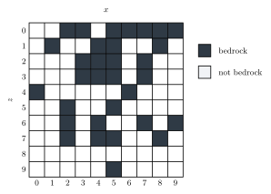
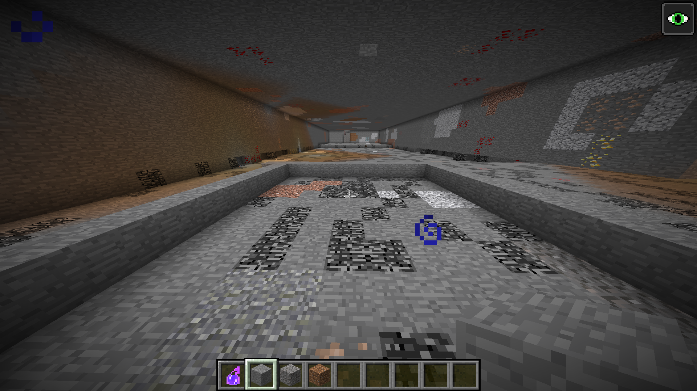

In `2Blue2Hen`, we are given a Minecraft 1.12 screenshot of a 10x10 room with a bedrock floor, and we are asked to find the coordinates where the player who took the screenshot is standing.


The fact that the floor is made of bedrock is a crucial hint, as bedrock generation in Minecraft is deterministic and independent of the world seed (it's the same for all worlds of the same version), and we know the bounds to search ($[-10,000, 10,000]$ in X and Z). This means we can brute-force search for the location of the player by regenerating the bedrock pattern for each possible location and checking if it matches the pattern of the bedrock floor.

## Getting the pattern

First we need to get the pattern. For that we can simply check the image, create an imaginary grid, and write it down in a spreadsheet. The final pattern would be like this:



An important and relevant note for the following steps is that there are bedrock blocks in the first layer of the walls, so we know 2 things from this:

- The probability of a 10x10 pattern of bedrock without any bedrock on the highest layer is very low, so we have a signal that we shouldn't only search on the top bedrock layer ($y=5$). It is possible (and probable) that the player removed at least one of the bedrock layers to make the 10x10 room, so we should also search on the lower layers ($y=4$ and maybe even $y=3$).

- When performing this kind of attack we usually benefit from knowing the orientation at which the user took the screenshot and its position relative to the chunk bounds. In this case the pattern is only 10x10 and we have no reference for which cardinal direction the player is looking at, so we have to take this into account when performing the exhaustive search.

## Finding the chunk

Now we need to actually find the chunk. As we said earlier, the bedrock generation is deterministic and independent of the seed, so we can simply regenerate the bedrock pattern. Thankfully this is a well known problem and there is a deep understanding of how bedrock is generated in Minecraft, so we can implement the bedrock generator and then brute-force search for the pattern. I used [this gist](https://gist.github.com/LuxXx/32b132a73e4073b9d2fe2544fb09a15d) as a reference and implemented the scanner in C with MPI to split the exhaustive search across multiple processes.

The main point is that we need to rebuild the bottom bedrock layers for each possible location and check if the pattern matches. We also need to take into account the 8 possible orientations of the pattern (4 rotations and 4 reflections) to make sure we don't miss any possible match.

## Solver logic

The solver is basically a distributed pattern matcher over regenerated bedrock. Instead of loading a Minecraft world, each MPI rank computes the same pseudo-random bedrock decision Minecraft 1.12 makes for each chunk, caches those chunk masks, and then scans a shard of the extracted 10x10 pattern over the search bounds.

We can represent the extracted floor as a binary grid, where `1` means bedrock and `0` means not bedrock:

```c
static int grid[10][10] = {
    {0,0,1,1,0,1,1,1,1,1},
    {0,1,0,0,1,1,0,0,1,0},
    {0,0,0,1,1,1,0,1,0,0},
    {0,0,0,1,1,1,0,1,0,0},
    {1,0,0,0,0,0,1,0,0,0},
    {0,0,1,0,0,1,0,0,0,0},
    {0,0,1,0,1,0,0,1,0,1},
    {0,0,1,0,1,1,0,0,1,0},
    {0,0,0,0,0,0,0,0,0,0},
    {0,0,0,0,0,1,0,0,0,0},
};
```

For each candidate position, the scanner has to try all possible ways the screenshot grid could map onto world coordinates. These are the 4 rotations plus the 4 mirrored versions:

```c
static int transform_point(int t, int x, int z, int *ox, int *oz) {
    switch (t) {
    case 0: *ox = x;         *oz = z;         break; // identity
    case 1: *ox = 9 - z;     *oz = x;         break; // rot90
    case 2: *ox = 9 - x;     *oz = 9 - z;     break; // rot180
    case 3: *ox = z;         *oz = 9 - x;     break; // rot270
    case 4: *ox = 9 - x;     *oz = z;         break; // flip x
    case 5: *ox = x;         *oz = 9 - z;     break; // flip z
    case 6: *ox = z;         *oz = x;         break; // transpose
    case 7: *ox = 9 - z;     *oz = 9 - x;     break; // anti-transpose
    default: return 0;
    }
    return 1;
}
```

The expensive part is bedrock lookup, so the solver first precomputes compact bitmasks for every chunk that could be touched by the search. The generation is driven by Java's 48-bit LCG, seeded only from the chunk coordinates:

```c
uint64_t start = java_seed(
    (int64_t)cx * 341873128712LL +
    (int64_t)cz * 132897987541LL
);

for (int lz = 0; lz < 16; lz++) {
    for (int lx = 0; lx < 16; lx++) {
        for (int y = 1; y <= 4; y++) {
            uint64_t sy = apply(jump_y[y - 1], col_seed);
            int val = (int)(sy >> 17) % 5;
            if (y <= val) {
                chunks[chunk_index(cx, cz)].row[y - 1][lz] |= (uint16_t)(1U << lx);
            }
        }
        col_seed = apply(jump_col, col_seed);
    }
}
```

After that, checking a candidate is cheap. The MPI part is intentionally simple: rank `r` handles every `size`-th X coordinate, so the ranks do not need to communicate while searching. For each candidate, the scanner transforms each bedrock cell from the screenshot into world-relative coordinates, looks it up in the precomputed chunk masks, and rejects the candidate as soon as one required bedrock block is missing. Only surviving candidates get a full 100-cell comparison against both bedrock and non-bedrock cells:

```c
for (int x = min_x + rank; x <= max_x; x += size) {
    for (int z = min_z; z <= max_z; z++) {
        for (int y = 1; y <= 4; y++) {
            for (int t = 0; t < 8; t++) {
                int ok = 1;
                for (int i = 0; i < pcount[t]; i++) {
                    Pt p = positives[t][i];
                    if (!is_bedrock_fast(x + p.dx, y, z + p.dz)) {
                        ok = 0;
                        break;
                    }
                }

                if (ok) {
                    int full = 0;
                    for (int gz = 0; gz < 10; gz++) {
                        for (int gx = 0; gx < 10; gx++) {
                            int tx, tz;
                            transform_point(t, gx, gz, &tx, &tz);
                            int have = is_bedrock_fast(x + tx, y, z + tz);
                            if (have == grid[gz][gx]) full++;
                        }
                    }

                    printf("rank=%d positive_match full=%d/100 x=%d y=%d z=%d transform=%s\n",
                           rank, full, x, y, z, tname(t));
                }
            }
        }
    }
}
```

Running it gives us:

```bash
mpicc -O3 -march=native search_bedrock.c -o search_bedrock
mpirun -np 8 ./search_bedrock
```

```log
...
rank=2 positive_match full=100/100 x=1370 y=3 z=490 transform=rot180
```

This means the pattern was found at chunk coordinates (1370, 490) with the screenshot being rotated 180 degrees. This is the only candidate that matches the pattern, so we can be confident that this is the correct chunk.

## Getting the exact coordinates

At this point we have a single candidate that set us in a single chunk in the map, now we can open up Minecraft and search for the exact point where the player is standing, an important point is that the crosshair is visible so we can use it to approximatly pinpoint whether the player is standing in the same level as the floor by checking for a similar angle/position of the crosshair to the block it is looking at. After some testing we find the following point:



At this point we simply can press F3 and check the coordinates, which are:

```
X: 1375
Y: 5
Z: 522
```

As the character is standing on a block, but we are asked the actual block coordinates, we need to subtract 1 from the Y coordinate to get the final answer:

```
X: 1375
Y: 4
Z: 522
```

So we can build the flag as:

```
UDCTF{1375_4_522}
```

## Greetings

Thanks to the Blue Hens CTF organizers for this amazing challenge and CTF in general, it had a lot of really interesting challenges and I had a lot of fun solving many of the hard-to-solve challenges, it has been a while since I saw a Minecraft challenge that I actually enjoyed solving.
