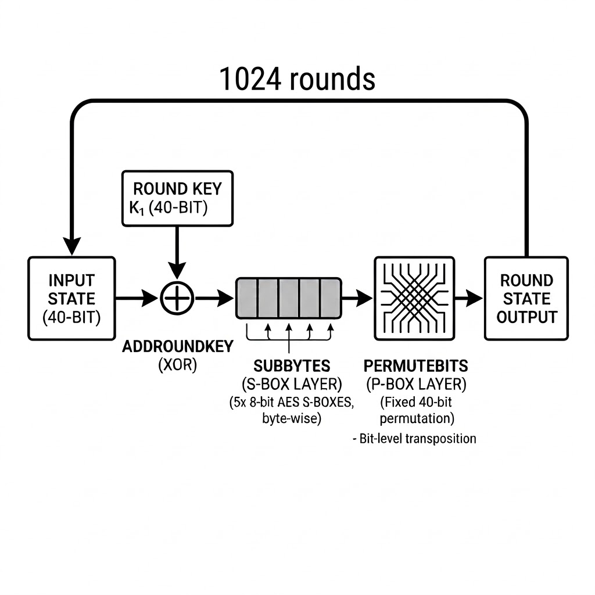

## Challenge statement

### `crypto/carry-the-flame`

**Goal:** interact with the remote service, recover the 5-byte secret key used by the cipher, submit it through the `guess` path, and get the flag.

**Flag format:** dice{<flag>}

---

## Inputs

* `crypto_carry-the-flame.tar.gz`
* netcat connection to `carry-the-flame.chals.dicec.tf` on port `1337`

---

## Challenge code and structure

This challenge presents us with a 1024-round SPN (Rijndael S-box, fixed 40-bit permutation) with a 40-bit key. The key is sampled separately for each connection, so the final guess must be submitted on the same live connection used to collect ciphertexts.

```python
for _ in range(ROUNDS):
    pt = bxor(pt, key)
    pt = sbox(pt)
    pt = pbox(pt)
```

> The core round function from `challenge.py`



The challenge gave a netcat interface to encrypt arbitrary plaintexts, but there were some constraints that made large data collection unfeasible:

- `Proof of work` on every connection (Testing many keys on many connections is not practical)
- `Key is per connection` (Can't collect data and perform attack "offline")
- `Oracle is slow for data-heavy attacks` (Large chosen-plaintext which could allow slide attacks or similar are not practical)

## First attempts

At first we tried to use a cryptoanalytic approach to find algebraic properties of the cipher to try to find a shortcut to the key using the structure of the cipher. We tried affine and linear probes, slide-attack style collection, and SAT/XOR-SAT solvers on reduced-round instances. However, none of these approaches were successful in finding a shortcut to the key within a reasonable time frame.

### Tested approaches:

#### Affine and linear probes

We tried to find affine relations (linear relations with a constant term) in the cipher by fixing the key and varying the plaintext. However, local experiments showed that the full 1024-round permutation was not affine in the plaintext bits for a fixed key. We also tried small linear-algebra probes to uncover useful low-dimensional relations, but these also failed to yield any useful information.


#### Slide-attack style collection

Because the same round function is repeated 1024 times with a fixed key, a slide-style approach was a natural candidate. We implemented batch collection and matching logic, but the remote oracle was too slow to gather enough material in practice. The implementation worked mechanically, but the attack path was operationally dead.

#### SAT and XOR-SAT

Finally, we tried to use SAT and XOR-SAT solvers to find the key by encoding the cipher as a Boolean formula. We worked on tiny reduced-round local instances and were able to solve 2-round cases, but 4-round and higher did not finish quickly enough to be useful. This approach was also not practical for the full 1024-round cipher, and even if this approach could "work" it would be very slow as SAT solvers are not designed for this kind of problem, they don't scale well with the number of rounds, and they can't be easily parallelized.

This showed that the cipher itself was designed to resist cryptoanalytic attacks (quite obvious because it is based on AES S-boxes and a fixed permutation, but it was worth trying), so we pivoted to a dirtier but more direct approach: brute force.

### The dirty but direct approach: brute force

The keyspace is only 2^40, which is large for CPU brute force, but very manageable on a modern GPU if each key test is cheap enough. The winning observation was that the per-round operation can be compressed into five table lookups and XORs, which allows us to implement a very efficient GPU kernel to test keys directly on the GPU.

For each byte position and each possible byte value, we precompute:

[T_i[b] = P(S(b) \ll \text{byte-shift}_i)]

Then one full round becomes:

[\text{round}(state, key)
= T_0[b_0] \oplus T_1[b_1] \oplus T_2[b_2] \oplus T_3[b_3] \oplus T_4[b_4]
]

This optimization avoids bit-level permutation work inside the hot loop and turns each round into a small fixed sequence of byte extraction, table loads, and XORs, which is very efficient on a GPU.

#### GPU brute force design

The solver was implemented using Numba (CuPy was also tried but was much slower). The implementation tested one candidate key per thread, encrypting the plaintext `0x0000000000` and rejecting immediately if the ciphertext did not match. If it matched, it would encrypt the plaintext `0x0000000001` and record the key if both matched. This means the second encryption almost never runs, and in practice the throughput is dominated by one 1024-round encryption per key candidate, not two. This was the most important optimization, as it allowed us to avoid the second encryption for most keys, which is a huge performance boost.

#### Parameter tuning

The thread count was tuned on the target machine (Nvidia A100-SXM4-40GB) and the best performance was achieved with 64 threads per block. We also tried different table layouts and using constant memory, but the plain per-byte round-table kernel was the best practical option.


### The real problem: same-connection submission

At this point the cryptanalytic problem was mostly solved, but the operational problem remained: the service key changes across connections, so a long brute-force run must keep the same socket alive, and the final `guess` must be sent on that same socket after the GPU hit. Earlier versions of the notebook were already able to brute force a session, but connection stability became the limiting factor.

To solve this issue we had to try multiple strategies to keep the connection alive, such as enabling TCP keepalive options, sending periodic keepalive pings, and implementing heartbeat logging to monitor the connection status. We also implemented post-chunk liveness checks to catch dead sessions before wasting more search time on a stale connection.

### Final successful run

Multiple runs were lost due to connection stability issues (most sessions died after about 1 hour of running).

After implementing the connection stability improvements, we were able to successfully recover the key and get the flag. The final session used:

- `pt0 = 0000000000`, `ct0 = e2dee15a57`
- `pt1 = 0000000001`, `ct1 = 4c214c70ac`

The successful run recovered:

- Key: `16db672e1e`
- Flag: `dice{t0g3th3r_br0k3n_4ab93cd2e17}`

### Why this solution worked

In the end, the challenge was less about finding a deep algebraic shortcut and more about choosing the right engineering strategy. The winning combination was:

- Accept that the key size is only `40` bits
- Move the round function into GPU-friendly precomputed tables
- Test keys directly on the GPU
- Keep the connection alive long enough to submit the key on the same session

This challenge shows that at times the best solution is not the most elegant one, but the one that is more practical and efficient given the constraints of the problem. In this case, a lot of time was spent trying to find a cryptoanalytic shortcut, but in the end, the "simplest" solution of brute forcing the key on a GPU was the one that worked.

#### Final notes

This challenge was a great example of how sometimes the easiest solution is not the most elegant one, and how engineering and practical considerations can often outweigh theoretical elegance in solving real-world problems. It also highlights the importance of being flexible and willing to pivot strategies when the initial approach does not yield results. I would call this an excellent example of the `Occam's Razor` principle applied to CTF challenges — "the simplest solution is often the best one." In this case, what made the difference was understanding the practical constraints of the problem and finding that the task could be efficiently parallelized on a GPU, which was the key to solving the challenge.

If you want, you can check the final notebook implementation [here](https://colab.research.google.com/drive/1p37k6aoMVxSwyNfybo3TeTGHxQk6vbA6?usp=sharing)