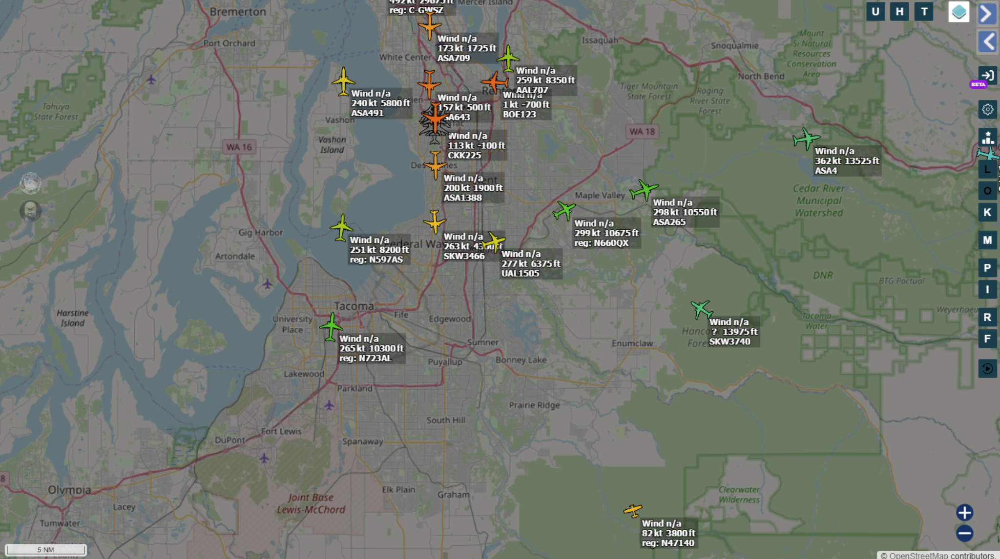

## Overview

In this OSINT challenge for Batman’s kitchen CTF, we were given a single photo (`sky.jpg`) containing a mountain and a small aircraft silhouette above it. And 2 tasks were given with this:
 
* get the flight number and baggage carousel number of the plane in the photo

* determine the location where the photo was taken

To solve this challenge, the main issues we had to solve were to identify the location of the mountain and, a time window when the photo was taken and some brief understanding of the direction where the photo was taken. With this information, and some geometry tricks (thanks to the available metadata of the photo) we were able (using an ADS-B replay) to reduce the number of candidates to 4, and then check the baggage carousel number for each of them until we found the correct one. With the correct flight identified, we had some extra information to use in our advantage to find the location of the photographer, as we knew the exact position and altitude of the plane at the moment the photo was taken and the position and altitude of the mountain, so we could make an estimation of the distance between the photographer and the plane, and then use that distance to find the location of the photographer along the line defined by the mountain and the plane.

## Challenge statements


### Part 1 — `osint/Eye on the Sky`

**Goal:** Determine the aircraft’s marketed flight number (operating airline) and the baggage carousel number.

**Flag format:** `bkctf{<flight_number>-<carousel>}` (no spaces)

### Part 2 — `osint/Eye on the Sky 2`

**Goal:** Determine the location of the photographer.

**Flag format:** `bkctf{<location>}` (lowercase, remove spaces)

---

## Inputs

* `sky.jpg`: A portrait-oriented photo containing a distant mountain and a small aircraft silhouette above it.
* `image.jpg`: The same image under a different filename.

---

## Methods and results

## 1. EXIF/metadata extraction

The first step was to check for useful metadata using `exiftool`, which can reveal parameters such as timestamps, GPS location (if present), and optical/shooting information.

Command used:

```bash
exiftool sky.jpg
```

Full output (as recorded):

```text
ExifTool Version Number         : 12.40
File Name                       : sky.jpg
Directory                       : .
File Size                       : 4.1 MiB
File Modification Date/Time     : 2026:02:22 01:12:45-05:00
File Access Date/Time           : 2026:02:22 01:13:21-05:00
File Inode Change Date/Time     : 2026:02:22 01:13:21-05:00
File Permissions                : -rw-r--r--
File Type                       : JPEG
File Type Extension             : jpg
MIME Type                       : image/jpeg
...
Date/Time Original              : 2026:01:19 09:18:43
Create Date                     : 2026:01:19 09:18:43
...
Create Date                     : 2026:01:19 09:18:43.44
Date/Time Original              : 2026:01:19 09:18:43.44
Modify Date                     : 2026:01:19 09:18:43.44
Thumbnail Image                 : (Binary data 4701 bytes, use -b option to extract)
Lens                            : 75.0 - 300.0 mm (35 mm equivalent: 116.6 - 466.3 mm)
Circle Of Confusion             : 0.019 mm
Field Of View                   : 15.5 deg
Focal Length                    : 85.0 mm (35 mm equivalent: 132.1 mm)
Hyperfocal Distance             : 11.68 m
Light Value                     : 16.0
```

### 1.3 Extracted constraints

From the EXIF dump, the constraints used downstream were:

* **Timestamp:** `2026-01-19 09:18:43.44` with **TZ = -08:00** (Los Angeles).
* **Focal length:** 85 mm (APS-C crop factor 1.6 given).
* **Field of view:** **15.5°** (critical for pixel→angle conversion).

The timestamp was converted to UTC for ADS-B replay:

[
T_{UTC} = 2026\text{-}01\text{-}19;17{:}18{:}43,\text{Z}
]

---

## 2. Landmark identification (mountain)

A reverse image search (e.g., Google Lens) was used to identify the mountain profile.

The peak was identified as **Mount Rainier (Washington State, USA)**. This also constrained the likely viewing sector to a north/northwestern viewpoint based on the visible face profile.


> **Figure 1:** `sky.jpg` (corrected for EXIF rotation).

---

## 3. ADS-B replay at capture time

Historical ADS-B traffic was queried using ADSBexchange:

* [https://globe.adsbexchange.com/](https://globe.adsbexchange.com/)

The replay time window was centered on ((T_{UTC} \approx 17{:}18{:}40,\text{Z})), matching the EXIF time within sub-second tolerance.

The ADS-B view at the replay time showed multiple aircraft in the region. A preliminary set of plausible candidates (based on proximity and altitude bands) included:

* `SKW3740` (SkyWest)
* `ASA4` (Alaska)
* `ASA265` (Alaska)
* `QXE2117` (Horizon)



> **Figure 2:** ADS-B replay overview around the Rainier region at ((T_{UTC} \approx 17{:}18{:}40,\text{Z})).

---

## 4. Angular constraint derivation from image geometry

Because the aircraft is only a few pixels in size, direct identification from livery is infeasible. Instead, the solution leverages geometric constraints: with a known camera field of view, a pixel displacement corresponds to an angular displacement in elevation.

### 4.1 Pixel → angle conversion

Given:

* EXIF field of view (vertical, portrait): ((\text{FOV} \approx 15.5^\circ))
* Rotated working image height: ((H = 2048)) px
* Measured aircraft vertical offset above the mountain summit silhouette along the same image column: ((\Delta y \approx 1180)) px

Approximate angular separation:

[
\Delta \theta \approx \text{FOV} \cdot \frac{\Delta y}{H}
= 15.5^\circ \cdot \frac{1180}{2048}
\approx 8.9^\circ
]

### 4.2 Elevation angle estimate

From a north/northwestern viewpoint at ~70–80 km range (consistent with typical traffic corridors in the Tacoma/Seattle area), the summit appears approximately ((\sim 2.7^\circ))–((3.3^\circ)) above the horizon (observer-elevation dependent). Therefore, the aircraft elevation was estimated at:

[
\theta_{plane} \approx (2.7^\circ\text{ to }3.3^\circ) + 8.9^\circ
\approx 11.6^\circ\text{ to }12.2^\circ
]

### 4.3 Apparent angular width sanity check

In the rotated image (width ((W = 1365)) px), the aircraft blob spanned ((\sim 16)) px. Using a short-side horizontal FOV of ((\sim 10^\circ)) (85 mm on APS-C in portrait), the apparent angular width was:

[
\theta_w \approx 10^\circ \cdot \frac{16}{1365} \approx 0.12^\circ
]

This is consistent with a commercial jet at tens of kilometers range (e.g., Embraer-class or 737-class) and implies an altitude band on the order of ((\sim 11{,}000))–((16{,}000)) ft given the ((\sim 12^\circ)) elevation estimate, disfavoring low-altitude aircraft candidates.

---

## 5. Aircraft identification and baggage carousel resolution

### 5.1 Candidate testing

Using the filtered candidate set from ADS-B replay, each candidate was checked on FlightAware to retrieve the **baggage claim carousel** associated with the flight.

The flag format required:

* Flight number as **marketed by the operating airline** (no spaces)
* `-`
* Baggage carousel identifier

### 5.2 Result

After testing the four candidate flight + carousel combinations, the accepted flag was:

**`bkctf{AS265-23T2}`**

This identifies the aircraft as Alaska Airlines marketed flight **AS265** with baggage carousel **23T2**.

---

## 6. Photographer location inference (Part 2)

With the aircraft identified, its precise state vector (lat/lon/alt) at capture time is available from ADS-B history. Because the aircraft appears vertically aligned above Mount Rainier in the image, the camera’s bearing is approximately collinear with the mountain–aircraft line, making perspective correction negligible.

### 6.1 Known values (from ADS-B + terrain)

* **Mount Rainier:** ((46.851405,,-121.757990)), elevation ((H_m = 14{,}411)) ft
* **Aircraft (AS265) at capture time:** ((47.371365,,-121.972296)), altitude ((H_p = 10{,}550)) ft
* **Distance aircraft→mountain:** ((D_m \approx 60.3)) km

### 6.2 Line-of-sight vector

Vector from mountain to airplane:

[
\Delta \text{Lat} = 47.371365 - 46.851405 = 0.51996
]

[
\Delta \text{Lon} = -121.972296 - (-121.757990) = -0.214306
]

Since the aircraft lies N–NW of the mountain, the photographer is located further N–NW along the same line (looking S–SE).

### 6.3 Distance to aircraft via apparent elevation ratio

Even though the plane is physically lower than the mountain, it appears much higher above the horizon in the photograph, implying the aircraft is much closer to the camera than the mountain. 

**Deriving the Apparent Height Ratio ($R$):**
To calculate exactly how much "higher" the plane appears in perspective, we analyzed the vertical pixel distances along the image's Y-axis. First, we estimated the true eye-level horizon line near the base of the visible terrain. We then measured two vertical pixel segments from this horizon line:
1. The distance to the mountain summit ($y_m$).
2. The distance to the aircraft ($y_p$).


The apparent height ratio ($R$) is defined as the quotient of these two apparent elevations:
$$R = \frac{y_p}{y_m}$$

Based on visual pixel estimation from the cropped image, the aircraft sits approximately 4.5 to 5 times higher above the true horizon than the peak of Mount Rainier, yielding $R \approx 4.5$–$5$.

Using the geometric relationship:
$$d_c = \frac{D_m \cdot H_p}{R \cdot H_m - H_p}$$

For ((R = 5)):

[
d_c = \frac{60.3\cdot 10550}{5\cdot 14411 - 10550}
= \frac{636165}{61505}
\approx 10.34;\text{km}
]

For ((R \approx 4.5)), ((d_c)) increases to roughly ((11.7)) km.

### 6.4 Back-projection to coordinates

Define the scale ((k = d_c / D_m)). With ((d_c \approx 10.34)) km and ((D_m \approx 60.3)) km:

[
k \approx 0.171
]

Extend the mountain→aircraft vector by ((k)) starting at the aircraft coordinate:

[
\text{Lat}_{cam} \approx 47.371365 + 0.51996\cdot 0.171 \approx 47.460
]

[
\text{Lon}_{cam} \approx -121.972296 + (-0.214306)\cdot 0.171 \approx -122.009
]

This corridor intersects the Tiger Mountain / Poo Poo Point / Squak Mountain region. Testing prominent viewpoints along this line yielded the correct location.

### 6.5 Result

Accepted flag:

**`bkctf{poopoopoint}`**

---

## Final flags

* **Eye on the Sky:** `bkctf{AS265-23T2}`
* **Eye on the Sky 2:** `bkctf{poopoopoint}`
