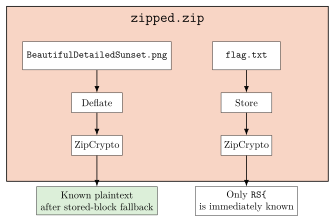
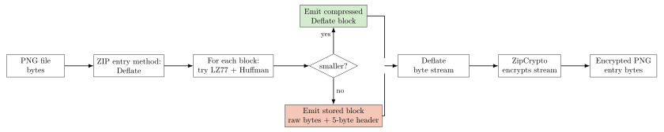
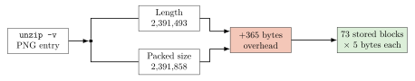
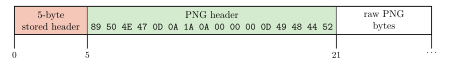
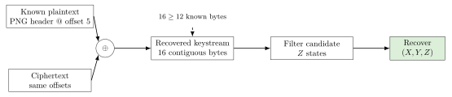
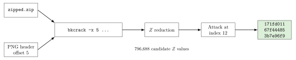
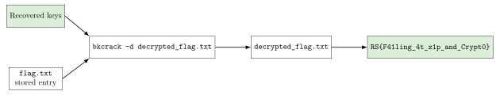

For this challenge, we are given a ZIP file, `zipped.zip`, that contains two encrypted files: a PNG image (`BeautifulDetailedSunset.png`) that occupies most of the archive's size (~2.3 MB), and a small text file (`flag.txt`) that contains the flag but is only 16 bytes long once decrypted.



# Initial attempts

The initial hypothesis was that the challenge could be solved either by breaking the weak RNG seed generation in Info-ZIP or by leveraging a known-plaintext attack on ZipCrypto. We explored both paths, but neither seemed feasible at first:

- **Info-ZIP Weak RNG Seed Recovery:** We successfully narrowed down the initial RNG seed space to just 73 candidates based on DOS timestamps and process IDs. However, Info-ZIP uses a double-encrypted header scheme, making it computationally expensive to verify each seed.
- **Direct PNG Known-Plaintext:** We also tried to use the PNG signature and `IHDR` bytes as known plaintext, but that failed because the file was Deflated rather than stored directly. ZipCrypto encrypts the Deflate stream, so the encrypted bytes did not line up with the raw PNG header at the offsets we first guessed.

# How the ZIP Stored the Image

First, we need to understand how the ZIP compressor handled the PNG file. ZipCrypto encrypts the compressed byte stream, not the raw file itself.

In this case, the compressor initially used the Deflate method for the PNG entry because the file looked like it might compress well. However, after running Deflate, it realized that the compressed output was actually larger than the original PNG because of the image's high entropy. At that point, the stream effectively fell back to stored blocks inside Deflate:



The Deflate compression algorithm works by finding repeated sequences of bytes and replacing them with references to earlier occurrences of those sequences (using LZ77 and Huffman coding). However, highly detailed images like `BeautifulDetailedSunset.png` have high entropy. When Deflate encounters such data, trying to compress it can actually *increase* the size because of the overhead of the Huffman trees.

When modern ZIP utilities detect that compressing a chunk of data is counterproductive, as in this case, they fall back to a fail-safe mode known as "stored blocks" (block type `00`). In a stored block, the compressor simply wraps raw, uncompressed bytes in a minimal 5-byte header:
1. 1 bit for `BFINAL` (is this the last block?)
2. 2 bits for `BTYPE` (`00` for stored)
3. 5 bits of padding to align to the next byte boundary.
4. 2 bytes for `LEN` (length of the block).
5. 2 bytes for `NLEN` (one's complement of `LEN`).

ZIP utilities typically segment these incompressible streams into maximum-sized 32 KB chunks ((32,768)) bytes. As the utility processed the PNG as an incompressible stream after the failed Deflate attempt, it repeatedly sliced the original image into 32 KB stored blocks and placed them directly into the Deflate stream.

The ZIP central directory gave us the two numbers we needed to verify that story:

- Uncompressed PNG size: ((2,391,493)) bytes
- Compressed (Deflated) PNG size: ((2,391,858)) bytes

Let's look at what that means:

[
2,391,858\ (Deflated) - 2,391,493\ (Uncompressed) = 365\ \text{bytes of overhead}
]

If the file is split into 32 KB chunks, how many chunks would it need?

[
\frac{2,391,493}{32,768} \approx 72.98 \rightarrow 73\ \text{blocks}
]

Thus, if we need exactly ((73)) blocks, and each block has a 5-byte header, the total overhead would be:

[
73\ \text{blocks} \times 5\ \text{bytes/block} = 365\ \text{bytes}
]

With these results, the hypothesis that the PNG was emitted as stored blocks becomes very strong, because the size math perfectly aligns with the expected overhead of 73 stored blocks.



Another way to look at it is that the compressed size is exactly 365 bytes larger than the uncompressed size, which is exactly the overhead of 73 stored blocks.

# Attack Vector: Biham-Kocher Known-Plaintext Attack

The stored-block fallback completely breaks the opacity of the compressed stream for this file. Normally, the compressed bitstream would be a chaotic mix of Huffman codes, making it impossible to align the known PNG header with the encrypted byte stream without having the full original image and recompressing it. However, because the compressor emitted the PNG as stored blocks, the raw bytes of the PNG are present in the compressed stream, only offset by the 5-byte block header. That means the PNG header sits intact at a predictable offset inside the encrypted stream. In other words, the compressed stream looks like this:



[
\begin{aligned}
[\text{5-byte Stored Block Header}] + [\text{Raw Uncompressed PNG Data}] + \ldots
\end{aligned}
]

The standard PNG header is exactly 16 bytes long: `89 50 4E 47 0D 0A 1A 0A 00 00 00 0D 49 48 44 52`.

At this point, the attack vector is clear. The PNG header is a known, fixed sequence of bytes that must be present in the compressed stream, and we know the offset needed to align it with the encrypted bytes, so we can use it as known plaintext against ZipCrypto.

This also explains why the earlier "generic PNG header" attempts with `bkcrack` failed. The problem was not that some parts of the PNG were encoded with Huffman codes while others were stored raw. The size math strongly suggests that the payload was emitted entirely as stored blocks, so the PNG bytes were present raw inside the Deflate stream. The real issue was alignment: `bkcrack` needs plaintext at the exact offsets that were fed into ZipCrypto, and the encrypted Deflate stream does **not** begin with `89 50 4E 47 ...`. It begins with the 5-byte stored-block header, and only then the PNG signature. So the naive known-plaintext attempt at offset ((0)) was wrong by exactly ((5)) bytes, and `bkcrack` rejected it even though the PNG header was indeed present in the stream.



The attack vector here is not guessing the password directly, nor is it reversing the weak RNG of the ZipCrypto compression. The real weakness is that ZipCrypto leaks its state when we can align known plaintext with the encrypted byte stream. As shown in the diagram, once we align the plaintext and ciphertext at the same offsets, we can recover the keystream, because XORing the plaintext with the ciphertext yields the keystream.

[
\text{Keystream} = \text{Plaintext} \oplus \text{Ciphertext}
]

From there, the attack works backwards through ZipCrypto's state update rules to recover the internal keys.

# Solver

With the 5-byte offset identified, the solver is straightforward:

```bash
bkcrack -C zipped.zip -c BeautifulDetailedSunset.png -x 5 89504E470D0A1A0A0000000D49484452
```

The `-x 5` option tells `bkcrack` to skip the first 5 bytes of the compressed stream and treat the next 16 bytes as known plaintext. The hex string is the exact PNG header, while `-C` and `-c` specify the encrypted archive and the target file, respectively.

# Results

After running the solver, `bkcrack` successfully reduced the ((Z)) values and recovered the internal ZipCrypto keys in just a few minutes:



```log
[19:57:21] Z reduction using 8 bytes of known plaintext
100.0 % (8 / 8)
[19:57:22] Attack on 796688 Z values at index 12
Keys: 171fd011 67f44485 3b7e96f9
41.9 % (333998 / 796688)
Found a solution. Stopping.
```

With the internal keys `171fd011 67f44485 3b7e96f9` recovered, we can then decrypt the target `flag.txt` file:

```bash
bkcrack -C zipped.zip -c flag.txt -k 171fd011 67f44485 3b7e96f9 -d decrypted_flag.txt
```



```log
RS{F41ling_4t_z1p_and_Crypt0}
```

# References

1. Eli Biham and Paul C. Kocher, *A Known Plaintext Attack on the PKZIP Stream Cipher*, FSE 1994, DOI: https://doi.org/10.1007/3-540-60590-8_12
2. `bkcrack` documentation and README: https://github.com/kimci86/bkcrack
